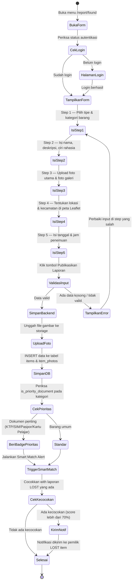
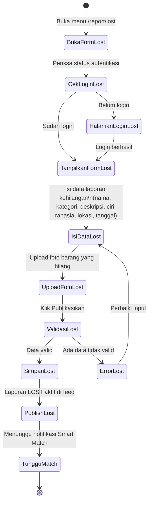

# Activity Diagram — Pelaporan Barang Ditemukan

Alur aktivitas dan percabangan keputusan saat pengguna melaporkan barang temuan.

---

## Pelaporan Barang Ditemukan (Found Item)

---

## Pelaporan Barang Hilang (Lost Item)

