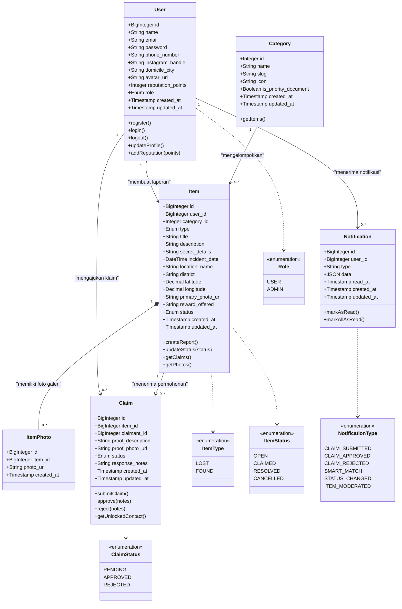

# Class Diagram — Find & Found

Struktur entitas data, model Eloquent ORM, atribut, tipe data, method, dan relasi antar kelas.

---

```mermaid
classDiagram
    direction TB

    class User {
        +BigInteger id
        +String name
        +String email
        +String password
        +String phone_number
        +String instagram_handle
        +String domicile_city
        +String avatar_url
        +Integer reputation_points
        +Enum role
        +Timestamp created_at
        +Timestamp updated_at
        +register()
        +login()
        +logout()
        +updateProfile()
        +addReputation(points)
    }

    class Category {
        +Integer id
        +String name
        +String slug
        +String icon
        +Boolean is_priority_document
        +Timestamp created_at
        +Timestamp updated_at
        +getItems()
    }

    class Item {
        +BigInteger id
        +BigInteger user_id
        +Integer category_id
        +Enum type
        +String title
        +String description
        +String secret_details
        +DateTime incident_date
        +String location_name
        +String district
        +Decimal latitude
        +Decimal longitude
        +String primary_photo_url
        +String reward_offered
        +Enum status
        +Timestamp created_at
        +Timestamp updated_at
        +createReport()
        +updateStatus(status)
        +getClaims()
        +getPhotos()
    }

    class ItemPhoto {
        +BigInteger id
        +BigInteger item_id
        +String photo_url
        +Timestamp created_at
    }

    class Claim {
        +BigInteger id
        +BigInteger item_id
        +BigInteger claimant_id
        +String proof_description
        +String proof_photo_url
        +Enum status
        +String response_notes
        +Timestamp created_at
        +Timestamp updated_at
        +submitClaim()
        +approve(notes)
        +reject(notes)
        +getUnlockedContact()
    }

    class Notification {
        +BigInteger id
        +BigInteger user_id
        +String type
        +JSON data
        +Timestamp read_at
        +Timestamp created_at
        +Timestamp updated_at
        +markAsRead()
        +markAllAsRead()
    }

    %% Enumerasi
    class Role {
        <<enumeration>>
        USER
        ADMIN
    }

    class ItemType {
        <<enumeration>>
        LOST
        FOUND
    }

    class ItemStatus {
        <<enumeration>>
        OPEN
        CLAIMED
        RESOLVED
        CANCELLED
    }

    class ClaimStatus {
        <<enumeration>>
        PENDING
        APPROVED
        REJECTED
    }

    class NotificationType {
        <<enumeration>>
        CLAIM_SUBMITTED
        CLAIM_APPROVED
        CLAIM_REJECTED
        SMART_MATCH
        STATUS_CHANGED
        ITEM_MODERATED
    }

    %% Relasi
    User "1" --> "0..*" Item : "membuat laporan"
    User "1" --> "0..*" Claim : "mengajukan klaim"
    User "1" --> "0..*" Notification : "menerima notifikasi"
    Category "1" --> "0..*" Item : "mengelompokkan"
    Item "1" *-- "0..*" ItemPhoto : "memiliki foto galeri"
    Item "1" --> "0..*" Claim : "menerima permohonan"

    User ..> Role
    Item ..> ItemType
    Item ..> ItemStatus
    Claim ..> ClaimStatus
    Notification ..> NotificationType
```
