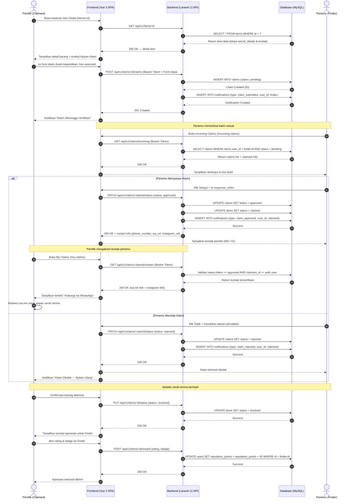

# Sequence Diagram — Alur Pengajuan & Verifikasi Klaim

Menampilkan interaksi berurutan antara Pemilik (Claimant), Frontend (Vue 3), Backend API (Laravel 12), Database (MySQL), dan Penemu (Finder).

---

