```mermaid
flowchart TD
    Root([Find & Found Web App\nVue 3 SPA])

    Root --> Public[PUBLIC ROUTES\nLayout: PublicLayout.vue\nGuard: none]
    Root --> UserRoutes[USER ROUTES\nLayout: AppLayout.vue\nGuard: authGuard]
    Root --> AdminRoutes[ADMIN ROUTES\nLayout: AdminLayout.vue\nGuard: adminGuard]

    Public --> P1["/ — Home\nHero, quick search, laporan terbaru,\ndokumen prioritas"]
    Public --> P2["/explore — Eksplorasi\nDaftar barang + multi-filter"]
    Public --> P3["/items/:id — Detail Barang\nFoto, deskripsi, peta, tombol klaim"]
    Public --> P4["/priority-documents — Dokumen Prioritas\nKTP / SIM / Paspor / Kartu Pelajar"]
    Public --> P5["/about — Tentang Platform\nPenjelasan & panduan penggunaan"]
    Public --> P6["/login — Login Akun"]
    Public --> P7["/register — Registrasi Akun Baru"]

    UserRoutes --> U1["/dashboard — Dashboard\nRingkasan aktivitas, statistik, notifikasi"]
    UserRoutes --> U2["/report/lost — Form Lapor Hilang\nForm bertahap barang hilang"]
    UserRoutes --> U3["/report/found — Form Lapor Ditemukan\nForm bertahap barang temuan"]
    UserRoutes --> U4["/my-reports — Laporan Saya\nDaftar & status laporan"]
    UserRoutes --> U5["/my-claims — Klaim Saya\nStatus klaim yang diajukan"]
    UserRoutes --> U6["/incoming-claims — Klaim Masuk\nReview klaim atas barang temuan"]
    UserRoutes --> U7["/notifications — Notifikasi\nSmart match & perubahan status"]
    UserRoutes --> U8["/profile — Profil\nAkun, no WA, IG, badge reputasi"]

    AdminRoutes --> A1["/admin/dashboard — Statistik Global\nKasus aktif, selesai, moderasi"]
    AdminRoutes --> A2["/admin/items — Moderasi Laporan\nReview, approve, hide, delete"]
    AdminRoutes --> A3["/admin/claims — Pengawasan Klaim\nSengketa & override klaim"]
    AdminRoutes --> A4["/admin/categories — Kelola Kategori\nCRUD & tanda prioritas dokumen"]
    AdminRoutes --> A5["/admin/users — Kelola Pengguna\nManajemen akun & blacklist"]
```

# Sitemap — Find & Found

Hierarki navigasi dan struktur Vue Router 4.

---

---

## Ringkasan Route

| Kelompok | Jumlah Halaman | Guard |
| :--- | :--- | :--- |
| Public | 7 halaman | — |
| Authenticated User | 8 halaman | `authGuard` |
| Admin | 5 halaman | `adminGuard` |
| **Total** | **20 halaman** | |
