# Use Case Diagram — Find & Found

Menampilkan semua aktor (Guest, User/Owner, Finder, Admin) beserta use case yang dapat mereka lakukan, lengkap dengan relasi `<<include>>`, `<<extend>>`, dan generalisasi aktor.

> **Catatan:** Mermaid belum mendukung sintaks UML Use Case penuh (`<<include>>`, `<<extend>>`, boundary sistem). Diagram di bawah menggunakan pendekatan terbaik yang tersedia di Mermaid, dilengkapi versi PlantUML di file `use-case-diagram.puml` untuk representasi UML standar yang lebih akurat.

---

## Diagram (Mermaid — Flowchart representasi Use Case)

```mermaid
flowchart LR
    subgraph Actors["Aktor"]
        Guest["👤 Guest\n(Belum Login)"]
        User["👤 User\n(Terdaftar)"]
        Owner["👤 Owner\n(Pemilik)"]
        Finder["👤 Finder\n(Penemu)"]
        Admin["👤 Admin"]
    end

    subgraph System["🔲 Sistem Find & Found"]
        subgraph PublicUC["Use Case — Publik"]
            UC01["Melihat Daftar Laporan"]
            UC02["Mencari & Filter Barang"]
            UC03["Melihat Detail Laporan"]
            UC04["Melihat Peta Sebaran"]
        end

        subgraph AuthUC["Use Case — Autentikasi"]
            UC05["Mendaftar Akun"]
            UC06["Login"]
            UC07["Logout"]
            UC08["Memperbarui Profil"]
        end

        subgraph FinderUC["Use Case — Finder (Penemu)"]
            UC09["Melaporkan Barang Temuan"]
            UC10["Upload Foto Barang"]
            UC11["Menandai Lokasi di Peta"]
            UC12["Mengelola Laporan Sendiri"]
            UC13["Melihat Klaim Masuk"]
            UC14["Menyetujui Klaim"]
            UC15["Menolak Klaim"]
            UC16["Koordinasi via WhatsApp/Instagram"]
            UC17["Menutup Laporan (Selesai)"]
        end

        subgraph OwnerUC["Use Case — Owner (Pemilik)"]
            UC18["Melaporkan Barang Hilang"]
            UC19["Mencari Barang Hilang"]
            UC20["Mengajukan Klaim Kepemilikan"]
            UC21["Upload Bukti Kepemilikan"]
            UC22["Memantau Status Klaim"]
            UC23["Mendapat Kontak Finder"]
        end

        subgraph SharedUC["Use Case — User Umum"]
            UC24["Menerima Notifikasi"]
            UC25["Menerima Smart Match Alert"]
            UC26["Melihat Profil & Reputasi"]
        end

        subgraph AdminUC["Use Case — Admin"]
            UC27["Mengelola Laporan (CRUD)"]
            UC28["Mengelola Pengguna"]
            UC29["Mengelola Kategori"]
            UC30["Memoderasi Konten"]
            UC31["Melihat Dashboard & Statistik"]
        end
    end

    Guest --> UC01
    Guest --> UC02
    Guest --> UC03
    Guest --> UC04
    Guest --> UC05
    Guest --> UC06

    User --> UC06
    User --> UC07
    User --> UC08
    User --> UC24
    User --> UC25
    User --> UC26

    Owner --> User
    Owner --> UC18
    Owner --> UC19
    Owner --> UC20
    Owner --> UC22
    Owner --> UC23

    Finder --> User
    Finder --> UC09
    Finder --> UC12
    Finder --> UC13
    Finder --> UC14
    Finder --> UC15
    Finder --> UC16
    Finder --> UC17

    Admin --> UC27
    Admin --> UC28
    Admin --> UC29
    Admin --> UC30
    Admin --> UC31

    UC09 -.->|<<include>>| UC06
    UC09 -.->|<<include>>| UC11
    UC09 -.->|<<extend>>| UC10
    UC18 -.->|<<include>>| UC06
    UC20 -.->|<<include>>| UC06
    UC20 -.->|<<include>>| UC03
    UC20 -.->|<<extend>>| UC21
    UC14 -.->|<<include>>| UC16
    UC22 -.->|<<extend>>| UC23
    UC19 -.->|<<extend>>| UC25
```

---

## Keterangan Relasi

| Relasi | Dari | Ke | Keterangan |
|---|---|---|---|
| `<<include>>` | Lapor Barang Temuan | Login | Wajib login sebelum melapor |
| `<<include>>` | Lapor Barang Temuan | Tandai Lokasi di Peta | Setiap laporan wajib menyertakan lokasi |
| `<<extend>>` | Lapor Barang Temuan | Upload Foto | Foto opsional, bisa tidak diisi |
| `<<include>>` | Lapor Barang Hilang | Login | Wajib login sebelum melapor |
| `<<include>>` | Ajukan Klaim | Login | Wajib login untuk klaim |
| `<<include>>` | Ajukan Klaim | Lihat Detail Laporan | Harus lihat detail dulu sebelum klaim |
| `<<extend>>` | Ajukan Klaim | Upload Bukti | Bukti foto opsional saat klaim |
| `<<include>>` | Setujui Klaim | Koordinasi WA/IG | Setelah setuju, kontak otomatis tersedia |
| `<<extend>>` | Pantau Status Klaim | Dapat Kontak Finder | Kontak hanya muncul jika klaim disetujui |
| `<<extend>>` | Cari Barang | Smart Match Alert | Alert opsional jika ada kecocokan |
| Generalisasi | Owner | User | Owner adalah spesialisasi User |
| Generalisasi | Finder | User | Finder adalah spesialisasi User |

---

## Aktor & Hak Akses

| Aktor | Deskripsi | Use Case Utama |
|---|---|---|
| **Guest** | Pengunjung tanpa akun | Browsing, cari, lihat detail, daftar, login |
| **User** | Pengguna terdaftar (umum) | Semua Guest + logout, edit profil, notifikasi |
| **Owner** | User yang melaporkan kehilangan | Semua User + lapor hilang, klaim, pantau |
| **Finder** | User yang melaporkan temuan | Semua User + lapor temuan, kelola klaim masuk |
| **Admin** | Pengelola platform | CRUD laporan, user, kategori, moderasi, statistik |
