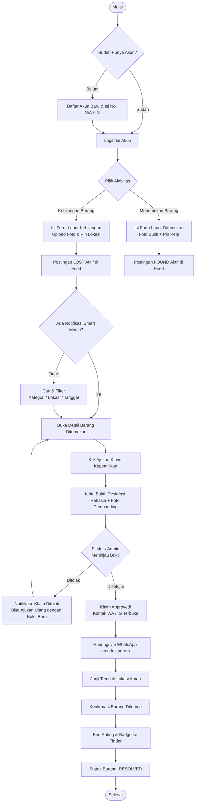
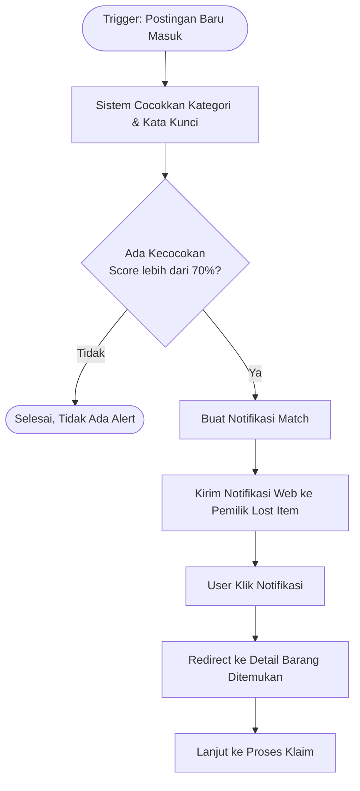
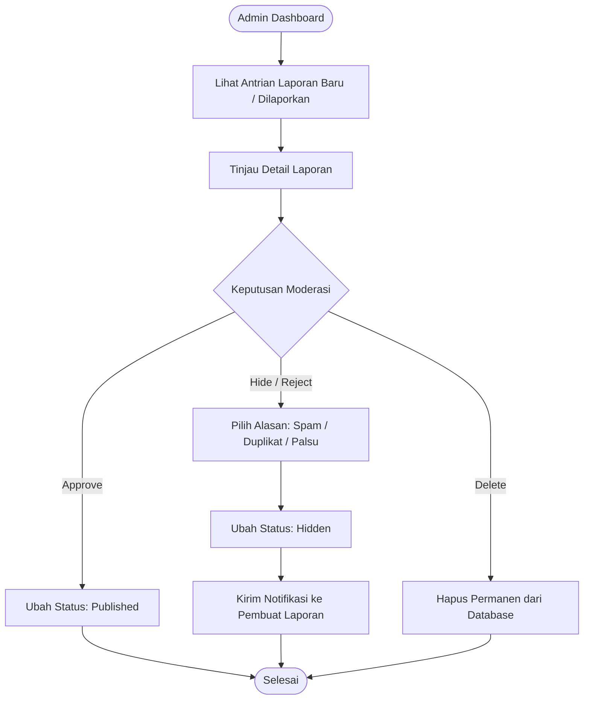
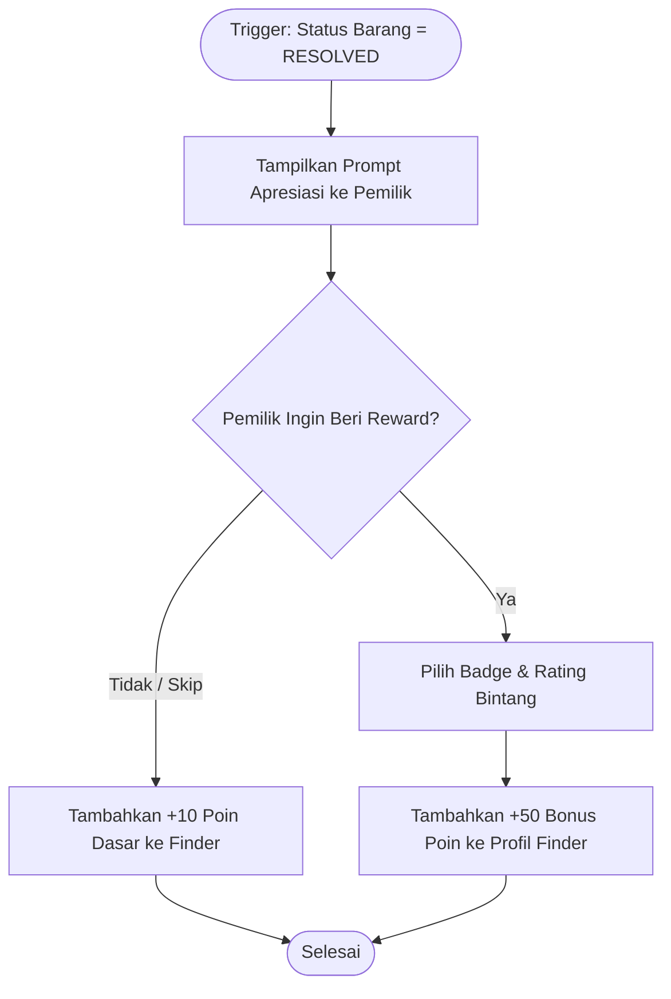

# User Flow — Find & Found

Diagram alur pengguna dari pendaftaran hingga serah terima barang.

---

## Alur Utama

---

## Alur Smart Match Alert

---

## Alur Moderasi Admin

---

## Alur Reward & Reputasi

