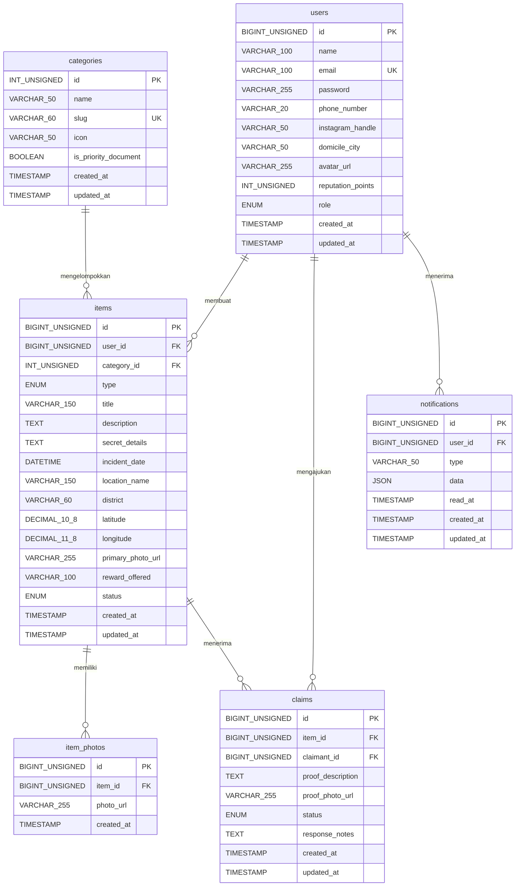

# Database Schema — Find & Found

**Engine:** MySQL / MariaDB 10.4+
**ORM:** Laravel 12 Eloquent
**Charset:** utf8mb4

---

## ERD (Entity Relationship Diagram)



---

## Detail Tabel

### 1. `users`

Menyimpan identitas akun pengguna, kontak WhatsApp, Instagram, dan data reputasi.

| Kolom | Tipe | Keterangan |
| :--- | :--- | :--- |
| `id` | BIGINT UNSIGNED | PK, Auto Increment |
| `name` | VARCHAR(100) | Nama lengkap pengguna |
| `email` | VARCHAR(100) | Unique, untuk login |
| `password` | VARCHAR(255) | Hash Bcrypt/Argon2 |
| `phone_number` | VARCHAR(20) | Nomor WA format `628...` |
| `instagram_handle` | VARCHAR(50) | Nullable, username IG tanpa @ |
| `domicile_city` | VARCHAR(50) | Default: 'Pati' |
| `avatar_url` | VARCHAR(255) | Nullable, path foto profil |
| `reputation_points` | INT UNSIGNED | Default: 0 |
| `role` | ENUM('user','admin') | Default: 'user' |
| `created_at` | TIMESTAMP | Auto |
| `updated_at` | TIMESTAMP | Auto |

---

### 2. `categories`

Master kategori barang beserta penanda prioritas dokumen penting.

| Kolom | Tipe | Keterangan |
| :--- | :--- | :--- |
| `id` | INT UNSIGNED | PK, Auto Increment |
| `name` | VARCHAR(50) | Contoh: "Kunci", "HP", "Dokumen Penting" |
| `slug` | VARCHAR(60) | Unique, contoh: `dokumen-penting` |
| `icon` | VARCHAR(50) | Nama icon Lucide/Heroicons |
| `is_priority_document` | BOOLEAN | Default: false — true untuk KTP/SIM/Paspor |
| `created_at` | TIMESTAMP | Auto |
| `updated_at` | TIMESTAMP | Auto |

**Data Seed Awal:**

| name | slug | is_priority_document |
| :--- | :--- | :--- |
| KTP / Identitas | ktp-identitas | true |
| SIM | sim | true |
| Paspor | paspor | true |
| Kartu Pelajar / Mahasiswa | kartu-pelajar | true |
| HP / Smartphone | hp-smartphone | false |
| Dompet | dompet | false |
| Kunci | kunci | false |
| Tas / Ransel | tas-ransel | false |
| Uang | uang | false |
| Lainnya | lainnya | false |

---

### 3. `items`

Menyimpan data laporan barang hilang maupun barang ditemukan.

| Kolom | Tipe | Keterangan |
| :--- | :--- | :--- |
| `id` | BIGINT UNSIGNED | PK, Auto Increment |
| `user_id` | BIGINT UNSIGNED | FK → `users.id`, ON DELETE CASCADE |
| `category_id` | INT UNSIGNED | FK → `categories.id` |
| `type` | ENUM('lost','found') | Tipe laporan |
| `title` | VARCHAR(150) | Judul barang, contoh: "Kunci Motor Honda Beat Hitam" |
| `description` | TEXT | Deskripsi kondisi & kronologi |
| `secret_details` | TEXT | Nullable — ciri rahasia untuk verifikasi klaim |
| `incident_date` | DATETIME | Waktu perkiraan hilang/ditemukan |
| `location_name` | VARCHAR(150) | Nama tempat, contoh: "Alun-alun Pati" |
| `district` | VARCHAR(60) | Kecamatan, contoh: "Juwana" |
| `latitude` | DECIMAL(10,8) | Nullable — koordinat lintang |
| `longitude` | DECIMAL(11,8) | Nullable — koordinat bujur |
| `primary_photo_url` | VARCHAR(255) | Path foto utama |
| `reward_offered` | VARCHAR(100) | Nullable — apresiasi dijanjikan |
| `status` | ENUM('open','claimed','resolved','cancelled') | Default: 'open' |
| `created_at` | TIMESTAMP | Auto |
| `updated_at` | TIMESTAMP | Auto |

**Status Lifecycle:**

```
open → claimed → resolved
open → cancelled
claimed → open (jika klaim ditolak)
```

---

### 4. `item_photos`

Galeri multi-foto pendukung untuk tiap laporan barang.

| Kolom | Tipe | Keterangan |
| :--- | :--- | :--- |
| `id` | BIGINT UNSIGNED | PK, Auto Increment |
| `item_id` | BIGINT UNSIGNED | FK → `items.id`, ON DELETE CASCADE |
| `photo_url` | VARCHAR(255) | Path file foto tambahan |
| `created_at` | TIMESTAMP | Auto |

---

### 5. `claims`

Menyimpan permohonan klaim kepemilikan atas barang yang ditemukan.

| Kolom | Tipe | Keterangan |
| :--- | :--- | :--- |
| `id` | BIGINT UNSIGNED | PK, Auto Increment |
| `item_id` | BIGINT UNSIGNED | FK → `items.id` |
| `claimant_id` | BIGINT UNSIGNED | FK → `users.id` (pemohon/pemilik) |
| `proof_description` | TEXT | Penjelasan bukti kepemilikan |
| `proof_photo_url` | VARCHAR(255) | Nullable — foto pembanding |
| `status` | ENUM('pending','approved','rejected') | Default: 'pending' |
| `response_notes` | TEXT | Nullable — catatan penemu saat approve/reject |
| `created_at` | TIMESTAMP | Auto |
| `updated_at` | TIMESTAMP | Auto |

**Aturan bisnis:**
- Satu item hanya boleh punya satu klaim aktif (`pending` atau `approved`) dalam satu waktu.
- Jika klaim `approved`: status item berubah menjadi `claimed`, kontak penemu terbuka.
- Jika klaim `rejected`: claimant bisa mengajukan ulang dengan bukti baru.

---

### 6. `notifications`

Menyimpan notifikasi untuk setiap pengguna (perubahan status, smart match, dll).

| Kolom | Tipe | Keterangan |
| :--- | :--- | :--- |
| `id` | BIGINT UNSIGNED | PK, Auto Increment |
| `user_id` | BIGINT UNSIGNED | FK → `users.id`, ON DELETE CASCADE |
| `type` | VARCHAR(50) | Tipe notif, contoh: `claim_approved`, `smart_match`, `status_changed` |
| `data` | JSON | Payload notifikasi (item_id, claim_id, pesan, dll) |
| `read_at` | TIMESTAMP | Nullable — null = belum dibaca |
| `created_at` | TIMESTAMP | Auto |
| `updated_at` | TIMESTAMP | Auto |

**Tipe notifikasi yang digunakan:**

| type | Trigger |
| :--- | :--- |
| `claim_submitted` | Penemu menerima klaim baru |
| `claim_approved` | Pemilik klaimnya disetujui |
| `claim_rejected` | Pemilik klaimnya ditolak |
| `smart_match` | Ada barang ditemukan yang cocok dengan laporan hilang |
| `status_changed` | Status laporan berubah |
| `item_moderated` | Admin memoderasi laporan pengguna |

---

## Relasi Antar Tabel

```
users (1) ──────< items (N)         [user membuat banyak laporan]
users (1) ──────< claims (N)        [user mengajukan banyak klaim]
users (1) ──────< notifications (N) [user menerima banyak notifikasi]
categories (1) ─< items (N)         [kategori mengelompokkan banyak item]
items (1) ──────< item_photos (N)   [item punya banyak foto]
items (1) ──────< claims (N)        [item menerima banyak klaim]
```

---

## Laravel Migration Order

Urutan migration Laravel yang benar (sesuai dependency FK):

1. `create_users_table`
2. `create_categories_table`
3. `create_items_table`
4. `create_item_photos_table`
5. `create_claims_table`
6. `create_notifications_table`
7. `add_personal_access_tokens_table` (dari Sanctum)
