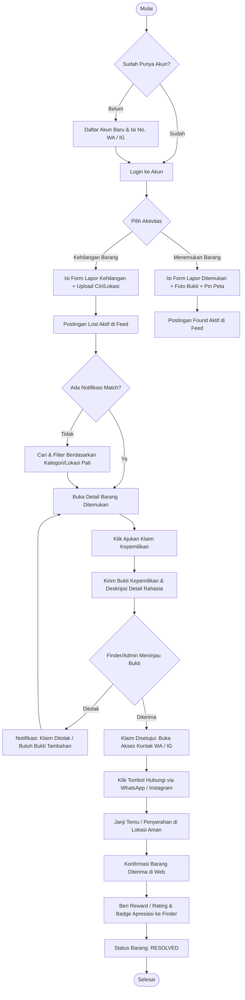
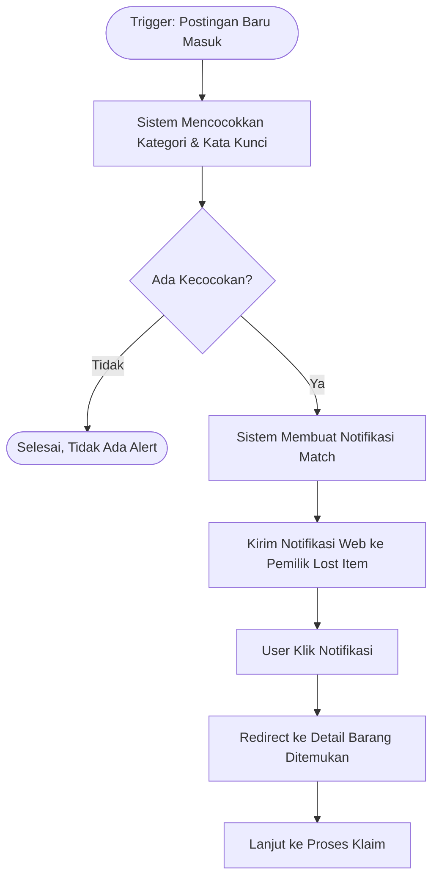
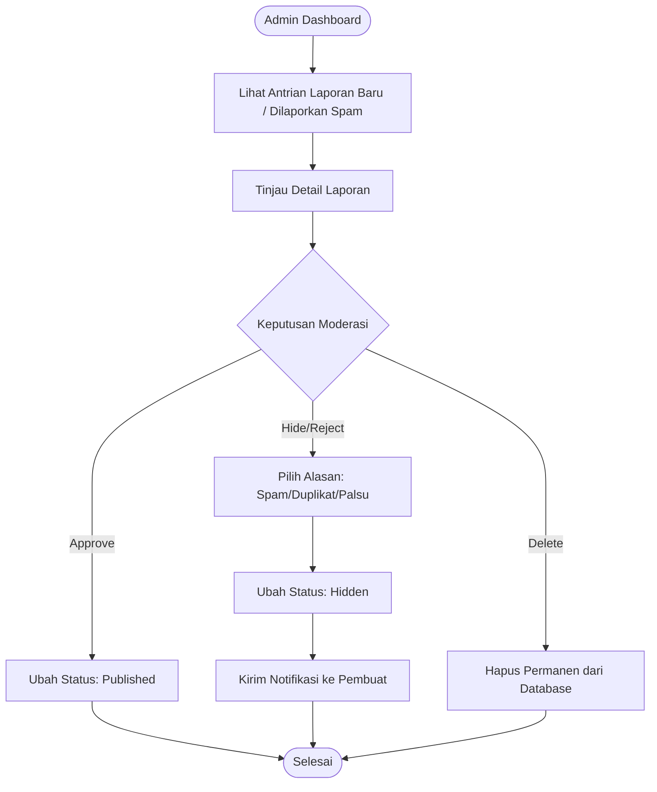
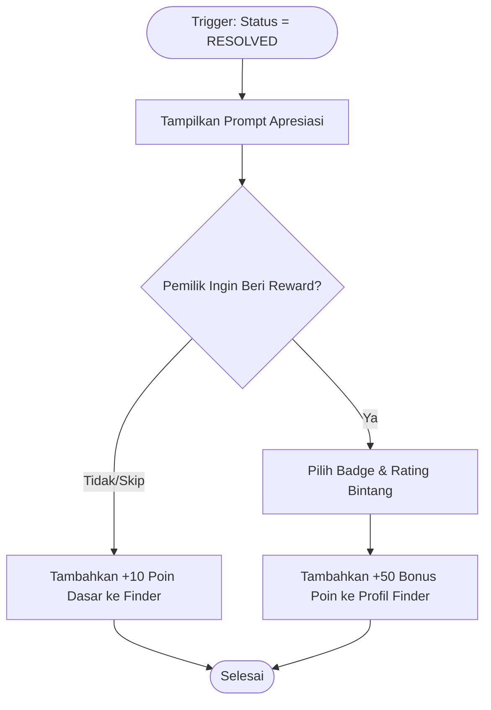
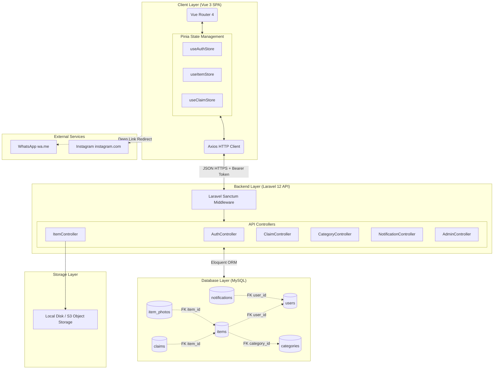

# PRODUCT REQUIREMENT DOCUMENT (PRD)

# Find & Found — Platform Penemu & Pencari Barang Hilang

---

## Informasi Dokumen

| Item | Keterangan |
| :--- | :--- |
| Nama Produk | Find & Found |
| Versi Dokumen | 2.1 |
| Tanggal Penyusunan | 23 Agustus 2026 |
| Jenis Produk | Web Application (SPA — Single Page Application) |
| Target Wilayah | Kabupaten Pati dan sekitarnya |
| Status | Final — Siap Implementasi |

**Identitas Kelompok — XII TJKT 1**

| No | Nama |
| :- | :--- |
| 1 | Muhammad Alqaus Sigit Widodo |
| 2 | Muhammad Roid Falih |
| 3 | Nabila Aufa Bilqis Ardiyani |
| 4 | Sekar Dwi Wulandari |
| 5 | Shaza Nurmalak |

**Dasar Perancangan:** Riset Data Survei 50 Responden (Kabupaten Pati & Sekitarnya), lihat [SURVEY_ANALYSIS.md](SURVEY_ANALYSIS.md).

---

## Tech Stack

| Bagian | Teknologi |
| :--- | :--- |
| Frontend | Vue.js 3 (Composition API, `<script setup>`), Vue Router 4, Pinia, Axios, Tailwind CSS, Leaflet.js / OpenStreetMap |
| Backend API | Laravel 12 (PHP 8.3+), RESTful API, Laravel Sanctum, Eloquent ORM |
| Database | MySQL / MariaDB 10.4+ |
| Storage | Local Disk (development) / Cloud Object Storage S3-compatible (production) |
| Integrasi Eksternal | WhatsApp Deep Link (`wa.me`) & Instagram Profile Link (`instagram.com`) |

---

# TAHAP 1: Product Overview & Problem Statement

## 1.1 Product Overview

**Find & Found** adalah platform web modern berbasis arsitektur _decoupled client-server_ (SPA) yang dirancang untuk memecahkan permasalahan barang dan dokumen hilang, khususnya pada kalangan pelajar dan masyarakat umum di wilayah Kabupaten Pati dan sekitarnya.

Platform ini menjadi jembatan informasi terpusat antara pihak yang kehilangan barang (_Owner_) dengan pihak yang menemukan barang (_Finder_). Dilengkapi fitur unggulan: penandaan lokasi (geo-tagging), verifikasi kepemilikan berbasis bukti, kategorisasi prioritas dokumen penting (KTP, SIM, Paspor, Kartu Pelajar), serta komunikasi langsung via redirect WhatsApp/Instagram setelah klaim disetujui.

## 1.2 Problem Statement

Berdasarkan data survei 50 responden:

1. **~90% responden** pernah mengalami kehilangan barang berharga.
2. **Barang paling sering hilang:** Kunci motor/rumah, Dompet, HP, Dokumen/Kartu Identitas (KTP, SIM, Kartu Siswa), Uang tunai.
3. **Kendala utama korban (urut terbanyak):**
   - Tidak ada wadah informasi terpusat saat barang ditemukan
   - Kebingungan tempat melapor
   - Sulitnya proses verifikasi & konfirmasi kepemilikan
   - Keterbatasan waktu untuk mencari secara fisik
4. **Perilaku penemu saat ini:** Mayoritas menyerahkan ke satpam/pengelola atau mengunggah ke media sosial yang cepat tenggelam.
5. **Skor urgensi aplikasi:** Rata-rata 4.5/5.0, mayoritas mutlak bersedia menggunakan.

## 1.3 Objectives

1. Menyediakan repositori data tunggal yang transparan untuk pelaporan barang hilang & ditemukan di area lokal.
2. Mempercepat pencarian melalui filter kategori, lokasi (per-kecamatan Pati), geo-tagging peta, dan notifikasi kecocokan.
3. Menyediakan mekanisme klaim kepemilikan yang aman untuk mencegah klaim palsu.
4. Mendorong kejujuran penemu melalui sistem reward, badge, dan poin reputasi.
5. Menjaga privasi: nomor kontak & identitas sensitif hanya terbuka setelah klaim diverifikasi.

---

# TAHAP 2: User Persona

## Persona 1: Korban Kehilangan (Owner / Seeker)

- **Demografi:** Pelajar SMA/SMK / Mahasiswa, usia 15–22 tahun, domisili Pati & sekitarnya.
- **Pain Points:** Panik, bingung melapor ke mana, tidak tahu apakah barang sudah ditemukan.
- **Goal:** Menemukan barang kembali dengan identitas kepemilikan terverifikasi, proses tidak ribet.

## Persona 2: Penemu Barang (Finder / Good Samaritan / Satpam)

- **Demografi:** Pelajar, masyarakat umum, satpam, atau staf pengelola fasilitas publik.
- **Pain Points:** Tidak punya kontak pemilik, takut dituduh mencuri jika menyimpan barang.
- **Goal:** Melaporkan barang temuan cepat, menitipkan di sistem, menyerahkan ke pemilik sah, dan mendapat apresiasi.

## Persona 3: Administrator Sistem

- **Demografi:** Pengelola web / admin komunitas / pihak sekolah atau institusi.
- **Goal:** Memoderasi postingan, memvalidasi laporan dokumen sensitif, memblokir laporan palsu/spam.

---

# TAHAP 3: Functional Requirements

| ID | Kategori | Deskripsi | Dasar Riset |
| :- | :--- | :--- | :--- |
| FR-01 | Autentikasi & Akun | Registrasi, login, logout, pemulihan password menggunakan token Sanctum. Wajib menyertakan nomor WA aktif dan opsional username Instagram. | WA preferensi #1 (>80% survei) |
| FR-02 | Form Lapor Barang Hilang | Posting laporan dengan: Nama Barang, Kategori, Foto, Tanggal & Jam, Lokasi Teks & Pin Peta, Deskripsi, Ciri Rahasia (opsional). | Mengatasi kendala "lupa lokasi/waktu" |
| FR-03 | Form Lapor Barang Ditemukan | Finder posting barang temuan dengan foto bukti, lokasi penemuan, kategori, opsi sembunyikan detail khusus untuk verifikasi. | Foto penting: skor 4.8/5.0 survei |
| FR-04 | Kategori Prioritas Dokumen | Sistem menandai KTP, SIM, Paspor, Kartu Pelajar dengan badge _High Priority_ dan menampilkannya di atas feed. | Saran responden survei #9 |
| FR-05 | Pencarian & Multi-Filter | Cari berdasarkan kata kunci, rentang tanggal, kategori, status (Lost/Found/Resolved), dan wilayah kecamatan Pati. | Dipilih 45+ dari 50 responden |
| FR-06 | Integrasi Peta & Lokasi | Peta interaktif Leaflet.js/OSM untuk menandai koordinat titik hilang/ditemukan. | Saran terbuka responden terbanyak |
| FR-07 | Verifikasi & Klaim Kepemilikan | Calon pemilik ajukan klaim dengan jawaban ciri khusus & foto pembanding. Penemu/Admin bisa approve atau reject. | Mengatasi "proses konfirmasi sulit" |
| FR-08 | Kontak via WhatsApp / Instagram | Setelah klaim disetujui, tampilkan deep-link `wa.me` dan/atau link profil Instagram dengan template pesan otomatis. | WA preferensi #1, efisiensi scope |
| FR-09 | Riwayat & Tracking Status | Dashboard riwayat laporan pribadi dengan status: `open`, `claimed`, `resolved`, `cancelled`. | Fitur pilihan utama survei |
| FR-10 | Reward & Apresiasi Penemu | Badge apresiasi ("Honest Finder"), poin reputasi, opsi reward sukarela dari pemilik. | >65% responden mau beri apresiasi |
| FR-11 | Notifikasi Smart Match | Sistem mencocokkan kata kunci & kategori antara postingan Lost dan Found baru, kirim notifikasi web. | Permintaan prioritas survei |
| FR-12 | Panel Moderasi Admin | Admin tinjau, setujui, sembunyikan, atau hapus postingan palsu/duplikat. Kelola master kategori, wilayah, dan akun pengguna. | Keamanan & validitas data publik |

---

# TAHAP 4: Non-Functional Requirements

| Parameter | Spesifikasi |
| :--- | :--- |
| Responsivitas | 100% responsif dari 360px (mobile) hingga 1920px (desktop); mobile-first |
| Performa | First Contentful Paint < 1.5 detik pada 4G; pergantian halaman SPA < 300ms |
| Keamanan | Nomor telepon & identitas dimasking di publik; kontak hanya terbuka setelah klaim approved; foto KTP diburamkan pada NIK; Bearer Token HTTPS |
| Ketersediaan | Uptime minimal 99%; error handling terpusat (Axios Interceptor + Toast Notification) |
| Format API | JSON standar, timestamp ISO-8601, HTTP status code semantik (200, 201, 400, 401, 403, 404, 422, 500) |

---

# TAHAP 5: User Flow

## 5.1 Alur Utama (Pelaporan → Klaim → Serah Terima)



## 5.2 Alur Smart Match Alert (FR-11)



## 5.3 Alur Moderasi Admin (FR-12)



## 5.4 Alur Reward & Reputasi (FR-10)



---

# TAHAP 6: Sitemap

```mermaid
flowchart TD
    Root([Find & Found Web App])

    Root --> Public[PUBLIC ROUTES]
    Root --> User[USER ROUTES]
    Root --> Admin[ADMIN ROUTES]

    Public --> P1[/ — Home]
    Public --> P2[/explore — Eksplorasi & Filter]
    Public --> P3[/items/:id — Detail Barang]
    Public --> P4[/priority-documents — Dokumen Prioritas]
    Public --> P5[/about — Tentang Platform]
    Public --> P6[/login — Login]
    Public --> P7[/register — Registrasi]

    User --> U1[/dashboard — Dashboard Aktivitas]
    User --> U2[/report/lost — Form Lapor Hilang]
    User --> U3[/report/found — Form Lapor Ditemukan]
    User --> U4[/my-reports — Riwayat Laporan]
    User --> U5[/my-claims — Klaim Saya]
    User --> U6[/incoming-claims — Klaim Masuk]
    User --> U7[/notifications — Notifikasi]
    User --> U8[/profile — Profil & Reputasi]

    Admin --> A1[/admin/dashboard — Statistik Global]
    Admin --> A2[/admin/items — Moderasi Laporan]
    Admin --> A3[/admin/claims — Pengawasan Klaim]
    Admin --> A4[/admin/categories — Kelola Kategori]
    Admin --> A5[/admin/users — Kelola Pengguna]
```

---

# TAHAP 7: Arsitektur Sistem

## 7.1 Alasan Arsitektur Decoupled SPA

1. **Pengalaman pengguna cepat:** Navigasi antar halaman tanpa reload penuh, filter dinamis, interaksi form foto instan.
2. **Skalabilitas multi-platform:** API Laravel dapat digunakan oleh Android/iOS di masa depan tanpa ubah logika bisnis.
3. **Separation of concerns:** Frontend fokus UI/state; Backend fokus validasi, otorisasi, keamanan transaksi.
4. **Efisiensi scope:** Redirect WhatsApp/Instagram memangkas kompleksitas real-time WebSocket.

## 7.2 Diagram Arsitektur Sistem



---

# TAHAP 8: MVP & Batasan Versi 1

## 8.1 Fitur MVP (Wajib Ada)

- Registrasi, login, logout, pemulihan password
- Form lapor barang hilang dan ditemukan (foto, lokasi, kategori)
- Pencarian & filter multi-parameter
- Detail barang dengan peta Leaflet
- Sistem klaim & verifikasi kepemilikan
- Kontak via WhatsApp/Instagram setelah klaim approved
- Riwayat laporan & tracking status
- Notifikasi perubahan status
- Badge prioritas dokumen penting
- Sistem reward & poin reputasi penemu
- Panel admin: moderasi, kategori, pengguna

## 8.2 Batasan MVP (Out of Scope v1)

- In-app real-time chat / WebSocket
- AI image recognition
- Mobile app (Android/iOS)
- GPS tracking real-time
- Integrasi email/WA otomatis (hanya deep link)
- QR Code & IoT

## 8.3 Roadmap

| Versi | Fitur Tambahan |
| :--- | :--- |
| v1.1 | Bookmark laporan, share ke media sosial, peta lokasi lebih detail |
| v1.2 | Auto-matching berdasarkan kategori + warna + lokasi + waktu, sistem reputasi lanjutan |
| v2.0 | AI photo matching, notifikasi email/WA otomatis, portal mitra institusi |

---

# TAHAP 9: Role & Akses

| Role | Akses |
| :--- | :--- |
| Guest | Lihat daftar barang, pencarian, registrasi |
| User | Semua akses Guest + lapor hilang/ditemukan, klaim, riwayat, notifikasi, profil |
| Admin | Semua akses User + moderasi laporan, kelola kategori, kelola pengguna, dashboard statistik |

---

# TAHAP 10: Success Metrics MVP

| Indikator | Target |
| :--- | :--- |
| Pengguna terdaftar | ≥ 500 pengguna |
| Laporan barang hilang | ≥ 200 laporan |
| Laporan barang ditemukan | ≥ 150 laporan |
| Tingkat keberhasilan pencocokan | ≥ 40% dari laporan berpasangan |
| Waktu rata-rata publikasi laporan | < 2 menit |
| Kepuasan pengguna | ≥ 80% menyatakan mudah digunakan |

---

*Dokumen ini merupakan versi final konsolidasi dari PRD v2.1. Untuk detail teknis lihat:*
- *[DATABASE_SCHEMA.md](DATABASE_SCHEMA.md) — skema tabel & ERD*
- *[API_ENDPOINTS.md](API_ENDPOINTS.md) — dokumentasi endpoint lengkap*
- *[DESIGN_SYSTEM.md](DESIGN_SYSTEM.md) — panduan desain visual*
