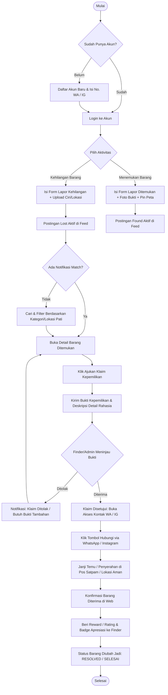

# PRODUCT REQUIREMENT DOCUMENT (PRD) & ARSITEKTUR SISTEM

# FIND & FOUND (Platform Penemu & Pencari Barang Hilang)

---

## Identitas Dokumen & Proyek

- **Nama Produk / Aplikasi :** Find & Found (Pembaruan dari nama sebelumnya: _TemuBarang_)
- **Versi Dokumen :** 2.1 (Direct External Communication & Handoff via WhatsApp/Instagram)
- **Tanggal Penyusunan :** 23 Agustus 2026
- **Dasar Perancangan :** Riset Data Survei 50 Responden (Kabupaten Pati & Sekitarnya), Dokumen Analisis `Find_and_Found.md`, serta Kerangka Jobsheet Pemrograman Web.
- **Tech Stack Utama :**
  - **Frontend :** Vue.js 3 (Composition API, `<script setup>`), Vue Router 4 `[Asumsi]`, Pinia `[Asumsi]`, Axios / Fetch API, Tailwind CSS `[Asumsi]`, Leaflet.js / OpenStreetMap `[Asumsi]`.
  - **Backend API :** Laravel 12 (PHP 8.3+), RESTful API Controller, Laravel Sanctum (Token-based Authentication), Form Request Validation, Eloquent ORM.
  - **Database :** MySQL / MariaDB 10.4+.
  - **Storage :** Local Disk Storage (Environment Development) / Cloud Object Storage S3-compatible (Production).
  - **Third-Party Integration :** WhatsApp Direct Deep Link (`wa.me`) & Instagram Profile Direct Link (`instagram.com`).

---

# TAHAP 1: Dokumen Kebutuhan Produk (PRD)

## 1.1 Product Overview

**Find & Found** adalah platform web modern berbasis _client-server_ (decoupled architecture) yang dirancang untuk memecahkan permasalahan hilangnya barang dan dokumen pribadi pada masyarakat, khususnya kalangan pelajar dan masyarakat umum di wilayah Kabupaten Pati dan sekitarnya.

Aplikasi ini menjadi jembatan informasi terpusat antara pihak yang kehilangan barang (_Owner / Loser_) dengan pihak yang menemukan barang (_Finder / Penemu / Pengelola / Satpam_). Dilengkapi dengan fitur unggulan seperti penandaan lokasi, verifikasi kepemilikan berbasis bukti/pertanyaan spesifik, kategorisasi prioritas untuk dokumen penting (KTP, SIM, Kartu Pelajar), serta sistem komunikasi langsung via redirect WhatsApp dan/atau Instagram setelah klaim disetujui.

## 1.2 Problem Statement & Validasi Masalah (Hasil Riset Survei)

Berdasarkan data mentah 50 responden survei (`Find_and_Found_Jawaban_Excel.md` & `Find_and_Found.md`):

1. **Tingkat Kejadian Nyata :** ~90% responden pernah mengalami kehilangan barang berharga.
2. **Barang Paling Rentan Hilang :** Kunci motor/rumah, Dompet, _Smartphone_ (HP), Dokumen/Kartu Identitas (KTP, SIM, Kartu Siswa/Mahasiswa), dan Uang tunai.
3. **Kendala Utama Korban :**
   - Tidak adanya wadah informasi terpusat ketika barang ditemukan (Kendala #1).
   - Kebingungan tempat melapor (Kendala #2).
   - Sulitnya proses verifikasi & konfirmasi kepemilikan yang sah (Kendala #3).
   - Keterbatasan waktu korban untuk mencari secara fisik berkeliling (Kendala #4).
4. **Perilaku Penemu Saat Ini :** Mayoritas menyerahkan ke satpam/pengelola pos terdekat atau mengunggah manual ke media sosial (Instagram/Facebook) yang cepat tenggelam oleh postingan lain.
5. **Kebutuhan Solusi :** Skor urgensi kebutuhan aplikasi mencapai rata-rata 4.5/5.0 dengan mayoritas mutlak menyatakan bersedia menggunakan aplikasi secara aktif.

## 1.3 Objectives (Tujuan Produk)

1. **Sentralisasi Informasi Kehilangan :** Menyediakan repositori data tunggal yang transparan dan _real-time_ untuk pelaporan barang hilang (_Lost_) dan barang ditemukan (_Found_) di area lokal.
2. **Mempercepat Pengembalian Barang :** Memangkas waktu pencarian hingga >60% dengan sistem pencarian pintar, filter kategori, penandaan lokasi (Geo-tagging), serta notifikasi kecocokan barang (_Matching Alert_).
3. **Validasi & Keamanan Kepemilikan :** Menyediakan mekanisme klaim kepemilikan yang aman untuk mencegah klaim palsu (_false claims_) atau penyalahgunaan barang berharga/identitas.
4. **Mendorong Kejujuran & Partisipasi Publik :** Memberikan penghargaan (_rewards/badge of honesty_) bagi penemu yang beriktikad baik mengembalikan barang.

## 1.4 User Persona

### Persona 1: Korban Kehilangan (Owner / Seeker)

- **Demografi :** Pelajar SMA/SMK / Mahasiswa (Usia 15–22 Tahun), Domisili Pati & sekitarnya.
- **Karakteristik :** Menggunakan smartphone untuk aktivitas harian, mobilitas tinggi di sekolah/kampus/tempat nongkrong, panik saat barang penting (KTP/Kunci/HP) hilang.
- **Pain Points :** Malu/bingung bertanya ke mana-mana, tidak tahu apakah barang sudah ditemukan orang lain, butuh respon cepat.
- **Goal :** Menemukan barangnya kembali dengan identitas kepemilikan yang terverifikasi tanpa ribet.

### Persona 2: Penemu Barang (Finder / Good Samaritan / Satpam)

- **Demografi :** Pelajar, Masyarakat Umum, Satpam / Staf Pengelola Fasilitas Publik.
- **Karakteristik :** Menemukan barang tercecer di area publik/sekolah, ingin mengembalikan ke pemilik sah namun tidak memiliki kontak pemilik.
- **Pain Points :** Takut dituduh mencuri jika menyimpan barang, malas mengurus jika proses lapornya berbelit-belit.
- **Goal :** Melaporkan barang temuan dengan cepat, menitipkan di sistem, dan menyerahkan ke pemilik sah (serta mendapatkan apresiasi positif).

### Persona 3: Administrator Sistem / Pengelola Wilayah

- **Demografi :** Pengelola Web / Admin Komunitas / Pihak Sekolah/Institusi.
- **Goal :** Memoderasi postingan, memvalidasi laporan dokumen sensitif, memblokir laporan palsu/spam, dan mengawasi proses serah terima barang.

---

# TAHAP 2: Kebutuhan Sistem (System Requirements)

## 2.1 Functional Requirements (Kebutuhan Fungsional)

Setiap fitur diturunkan langsung dari temuan survei atau ditandai `[Asumsi]` bila merupakan pelengkap teknis:

| ID Fitur  | Kategori                                              | Deskripsi Kebutuhan Fungsional                                                                                                                                                                                                                 | Dasar Keputusan Riset / Ref                                                                             |
| :-------- | :---------------------------------------------------- | :--------------------------------------------------------------------------------------------------------------------------------------------------------------------------------------------------------------------------------------------- | :------------------------------------------------------------------------------------------------------ |
| **FR-01** | Autentikasi & Akun                                    | Sistem mendukung registrasi, login, logout, dan pemulihan password menggunakan JWT / Token Sanctum. Pengguna wajib menyertakan nomor kontak WhatsApp aktif dan opsional username Instagram.                                                    | Memudahkan kontak langsung via WA/IG (Hasil Survei: WA preferensi #1, >80%).                            |
| **FR-02** | Form Lapor Barang Hilang (_Lost Item_)                | User dapat memposting laporan kehilangan dengan field: Nama Barang, Kategori, Foto Barang, Tanggal & Jam Perkiraan Hilang, Lokasi Terakhir (Teks & Pin Peta), Deskripsi Detail, serta Ciri Rahasia (opsional untuk verifikasi).                | Form terstruktur mengatasi kendala "lupa lokasi/waktu & tidak ada info".                                |
| **FR-03** | Form Lapor Barang Ditemukan (_Found Item_)            | Finder/Satpam dapat memposting barang temuan dengan foto bukti, lokasi penemuan, kategori, dan opsi menyembunyikan detail khusus agar diverifikasi calon pemilik.                                                                              | Validasi upload foto (Skor penting foto: 4.8/5.0 pada survei).                                          |
| **FR-04** | Kategori Khusus Dokumen Prioritas                     | Sistem menandai dokumen identitas (KTP, SIM, Paspor, Kartu Pelajar) dengan badge _High Priority_ dan menampilkannya di bagian atas feed/pencarian.                                                                                             | Saran Responden #9 (Excel Survei): "bedakan dokumen penting KTP/SIM agar diposisikan paling atas".      |
| **FR-05** | Pencarian & Multi-Filter Dinamis                      | Pengguna dapat mencari barang berdasarkan kata kunci, rentang tanggal, filter kategori, status barang (_Lost/Found/Resolved_), dan filter wilayah/lokasi (Pati Kota, Juwana, Sukolilo, Cluwak, dll).                                           | Fitur prioritas tertinggi di survei (dipilih 45+ responden).                                            |
| **FR-06** | Integrasi Peta & Share Lokasi                         | Peta interaktif (Leaflet.js/OSM) untuk menandai koordinat titik hilang/ditemukan dan tombol _Share Location_.                                                                                                                                  | Saran terbuka responden (#3, #6, #25: "fitur share lokasi / real-time location").                       |
| **FR-07** | Sistem Verifikasi & Klaim Kepemilikan                 | Calon pemilik dapat mengajukan klaim kepemilikan dengan menjawab pertanyaan verifikasi (misal: ciri khusus, isi dompet, wallpaper HP) dan mengunggah foto pembanding. Penemu/Admin dapat menyetujui (_Approve_) atau menolak (_Reject_) klaim. | Mengatasi kendala survei: "Proses konfirmasi kepemilikan sulit".                                        |
| **FR-08** | Kontak & Handoff via WhatsApp / Instagram             | Begitu klaim disetujui, sistem menampilkan tombol deep-link ke WhatsApp (`wa.me`) dan/atau Instagram penemu & pemilik dengan template pesan otomatis untuk koordinasi serah terima di lokasi aman.                                             | Hasil survei: WhatsApp preferensi #1 (>80%). Efisiensi scope tanpa overhead WebSocket/in-app messaging. |
| **FR-09** | Riwayat Laporan & Tracking Status                     | User memiliki dashboard riwayat pelaporan pribadi dengan status transparan: `Draft`, `Published`, `Claimed`, `Returned / Resolved`, `Closed`.                                                                                                  | Fitur pilihan utama responden survei ("Riwayat laporan").                                               |
| **FR-10** | Sistem Reward & Apresiasi Penemu                      | Sistem menyediakan badge apresiasi ("Honest Finder"), point reputasi, serta opsi dari pemilik untuk menyematkan janji reward sukarela.                                                                                                         | Validasi survei: >65% responden mau menerima reward/apresiasi atas kejujuran.                           |
| **FR-11** | Notifikasi Kecocokan (_Smart Match Alert_) `[Asumsi]` | Sistem secara otomatis mencocokkan kata kunci & kategori antara postingan _Lost_ dan _Found_ baru, lalu mengirimkan notifikasi web ke pengguna.                                                                                                | Permintaan prioritas survei ("Notifikasi jika ada barang yang mirip").                                  |
| **FR-12** | Panel Moderasi Admin `[Asumsi]`                       | Admin dapat meninjau, menyetujui, menyembunyikan, atau menghapus postingan palsu/duplikat serta mengelola master kategori dan wilayah.                                                                                                         | Menjaga validitas dan keamanan data publik.                                                             |

## 2.2 Non-Functional Requirements (Kebutuhan Non-Fungsional)

| Parameter                        | Spesifikasi & Batasan Teknis                                                                                                                                                                                                                                                  |
| :------------------------------- | :---------------------------------------------------------------------------------------------------------------------------------------------------------------------------------------------------------------------------------------------------------------------------- |
| **Responsivitas & Mobile-First** | Antarmuka web harus 100% responsif pada layar ponsel (360px - 430px) hingga desktop (1920px), mengingat >90% target responden mengakses lewat smartphone.                                                                                                                     |
| **Performa & Kecepatan Akses**   | Waktu muat awal (_First Contentful Paint_) < 1.5 detik pada koneksi 4G; SPA client-side routing Vue menghasilkan pergantian halaman instan (< 300ms).                                                                                                                         |
| **Keamanan Data & Privasi**      | Nomor telepon/identitas sensitif tidak ditampilkan publik secara telanjang (masking data); kontak WhatsApp/IG hanya dibuka setelah klaim disetujui (_verified claim_). Foto KTP/dokumen diburamkan pada nomor NIK publik. Autentikasi API dilindungi oleh Bearer Token HTTPS. |
| **Reliabilitas & Ketersediaan**  | Sistem memiliki tingkat ketersediaan (_uptime_) minimal 99% dengan penanganan error terpusat (Global Axios Interceptor & Toast Notifications).                                                                                                                                |
| **Standar RESTful JSON**         | Seluruh komunikasi data frontend dan backend wajib menggunakan format JSON standar ISO-8601 untuk timestamp dan status HTTP code yang semantik (200, 201, 400, 401, 403, 404, 422, 500).                                                                                      |

---

# TAHAP 3: User Flow & Sitemap

## 3.1 User Flow Utama (Alur Pelaporan, Pencarian, Klaim & Serah Terima)




*Gambar 3.1 — Visualisasi alur utama pengguna dari pendaftaran akun, pelaporan barang hilang/ditemukan, proses klaim & verifikasi, hingga serah terima dan pemberian reward.*

### 3.1.1 User Flow: Smart Match Alert (FR-11) `[Asumsi]`

```mermaid
flowchart TD
    StartAlert([Trigger: Postingan Baru Masuk]) --> SystemCheck[Sistem Mencocokkan Kategori & Kata Kunci]
    SystemCheck --> MatchFound{Apakah Ada Kecocokan?}

    MatchFound -- Tidak --> EndAlert([Selesai, Tidak Ada Alert])
    MatchFound -- Ya (Score > 70%) --> GenerateNotif[Sistem Membuat Notifikasi Match]

    GenerateNotif --> SendToUser[Kirim Notifikasi Web / Email ke Pemilik Lost Item]
    SendToUser --> UserClick[User Mengklik Notifikasi]
    UserClick --> RedirectDetail[Redirect ke Halaman Detail Barang Ditemukan (Found)]
    RedirectDetail --> ClaimAction[Lanjut ke Proses Klaim Kepemilikan]
```

### 3.1.2 User Flow: Moderasi Admin (FR-12) `[Asumsi]`

```mermaid
flowchart TD
    StartAdmin([Admin Dashboard]) --> ViewQueue[Melihat Antrian Laporan Baru / Dilaporkan Spam]
    ViewQueue --> ReviewItem[Meninjau Detail Laporan (Foto, Deskripsi, Kategori)]

    ReviewItem --> AdminDecision{Keputusan Moderasi}

    AdminDecision -- Approve --> StatusPublished[Ubah Status: Published]
    StatusPublished --> EndAdmin([Selesai])

    AdminDecision -- Hide / Reject --> AddReason[Pilih Alasan Penolakan (Spam/Duplikat/Palsu)]
    AddReason --> StatusHidden[Ubah Status: Hidden / Rejected]
    StatusHidden --> NotifyCreator[Kirim Notifikasi ke Pembuat Laporan]
    NotifyCreator --> EndAdmin

    AdminDecision -- Delete --> HardDelete[Hapus Permanen dari Database]
    HardDelete --> EndAdmin
```

### 3.1.3 User Flow: Reward & Reputasi (FR-10)

```mermaid
flowchart TD
    StartReward([Trigger: Status Barang = RESOLVED]) --> AskRating[Sistem Menampilkan Prompt Apresiasi]
    AskRating --> OwnerDecision{Pemilik Ingin Memberi Reward?}

    OwnerDecision -- Tidak / Skip --> DefaultPoint[Tambahkan +10 Poin Dasar ke Finder]
    DefaultPoint --> EndReward([Selesai])

    OwnerDecision -- Ya --> SelectBadge[Pilih Badge & Rating Bintang (Misal: 'Honest Finder')]
    SelectBadge --> AddBonusPoint[Tambahkan +50 Bonus Poin ke Profil Finder]
    AddBonusPoint --> EndReward
```

## 3.2 Sitemap (Hierarki Navigasi & Struktur Vue Router 4)

Struktur hierarki halaman dirancang modular dengan pemisahan akses Tamu (_Public_), Pengguna Terautentikasi (_User_), dan Administrator (_Admin_):

```text
Find & Found Web App (Vue 3 SPA)
│
├── 🌐 PUBLIC ROUTES (Layout: PublicLayout.vue)
│   ├── / (Home / Landing Page & Feed Ringkasan)
│   ├── /explore (Eksplorasi Barang Hilang & Ditemukan + Multi-Filter)
│   ├── /items/:id (Detail Barang & Deskripsi Penemuan)
│   ├── /priority-documents (Kategori Khusus Dokumen Penting KTP/SIM/Paspor)
│   ├── /about (Tentang Platform & Komunitas Pati)
│   ├── /login (Login Akun)
│   └── /register (Registrasi Akun Baru)
│
├── 👤 AUTHENTICATED USER ROUTES (Layout: AppLayout.vue, Guard: authGuard)
│   ├── /dashboard (Ringkasan Aktivitas, Statistik Barang & Notifikasi)
│   ├── /report/lost (Formulir Lapor Barang Hilang)
│   ├── /report/found (Formulir Lapor Barang Ditemukan)
│   ├── /my-reports (Riwayat Laporan Saya: Aktif, Terklaim, Selesai)
│   ├── /my-claims (Daftar Pengajuan Klaim Saya & Status Verifikasinya)
│   ├── /incoming-claims (Daftar Klaim Masuk atas Barang Temuan Saya)
│   ├── /notifications (Pusat Notifikasi Keselarasan Barang & Status)
│   └── /profile (Pengaturan Profil, Nomor WhatsApp, Instagram, & Badge Reputasi)
│
└── 🛡️ ADMIN PANEL ROUTES (Layout: AdminLayout.vue, Guard: adminGuard)
    ├── /admin/dashboard (Statistik Global Kasus Selesai vs Aktif)
    ├── /admin/items (Moderasi Seluruh Laporan Barang & Flag Spam)
    ├── /admin/claims (Pengawasan Sengketa Klaim Kepemilikan)
    ├── /admin/categories (Kelola Kategori: Elektronik, Dokumen, Kunci, dll)
    └── /admin/users (Manajemen Akun Pengguna & Blacklist)
```


*Gambar 3.2 — Diagram visual sitemap Find & Found, menampilkan hierarki 3 kelompok akses (Public, Authenticated User, Admin) sesuai struktur Vue Router 4 di atas.*

### 3.3 Low-Fidelity Wireframe

.png)

.png)

.png)

.png)

.png)

.png)

.png)

.png)

.png)

.png)

.png)

.png)

.png)

.png)

.png)

.png)

.png)

.png)

.png)

.png)

*Gambar 3.3 — Rancangan wireframe low-fidelity untuk seluruh 20 halaman aplikasi, mencakup 3 kelompok akses: Public Routes, Authenticated User Routes, dan Admin Panel Routes, sebagai dasar validasi struktur layout sebelum tahap desain visual (high-fidelity).*

---

# TAHAP 4: Arsitektur Sistem & Perancangan Database

## 4.1 Alasan Pemilihan Arsitektur Decoupled (Client-Server)

Pengembangan aplikasi Find & Found menggunakan pola arsitektur **Modern Decoupled / Single Page Application (SPA)** dengan frontend **Vue.js 3** yang terpisah sepenuhnya dari backend **Laravel 12 REST API**:

1. **Pengalaman Pengguna Cepat & Halus (_App-Like Experience_) :** Navigasi antar halaman, filter barang secara dinamis, dan interaksi form foto berjalan tanpa reload halaman penuh (_zero page reload_).
2. **Skalabilitas Multi-Platform :** Backend API Laravel yang dibangun dapat digunakan di masa depan untuk aplikasi Android/iOS (_Native/Flutter_) tanpa perlu mengubah logika bisnis backend.
3. **Pemisahan Peran Pengembangan (_Separation of Concerns_) :** Frontend fokus pada rendering UI, state management, interaktivitas visual, dan caching lokal (Pinia); Backend fokus pada validasi data, otorisasi, keamanan transaksi basis data, dan notifikasi.
4. **Efisiensi Beban Server & Scope Proyek :** Menggunakan external redirect WhatsApp/Instagram memangkas kompleksitas real-time server socket, mengurangi latency, dan memanfaatkan ekosistem komunikasi yang sudah familiar digunakan oleh masyarakat lokal.

### 4.1.1 Diagram Arsitektur Sistem (Component & System Flow)

```mermaid
flowchart TD
    %% Subgraph Client Layer
    subgraph ClientLayer ["🖥️ Client Layer (Vue 3 SPA)"]
        VueRouter(Vue Router 4)

        subgraph PiniaStores ["📦 Pinia State Management"]
            AuthStore[useAuthStore]
            ItemStore[useItemStore]
            ClaimStore[useClaimStore]
        end

        AxiosClient(Axios HTTP Client)

        VueRouter <--> PiniaStores
        PiniaStores <--> AxiosClient
    end

    %% Subgraph Backend Layer
    subgraph BackendLayer ["⚙️ Backend Layer (Laravel 12 API)"]
        Sanctum[Laravel Sanctum Auth Middleware]

        subgraph Controllers ["🛠️ API Controllers"]
            AuthController[Auth Controller]
            ItemController[Items Controller]
            ClaimController[Claims Controller]
            CategoryController[Categories Controller]
        end

        Sanctum --> Controllers
    end

    %% Subgraph Database Layer
    subgraph DatabaseLayer ["🗄️ Database Layer (MySQL/MariaDB)"]
        DB_Users[(users)]
        DB_Items[(items)]
        DB_Claims[(claims)]
        DB_Categories[(categories)]
        DB_Photos[(item_photos)]

        DB_Items -.-> |FK user_id| DB_Users
        DB_Items -.-> |FK category_id| DB_Categories
        DB_Claims -.-> |FK item_id| DB_Items
        DB_Photos -.-> |FK item_id| DB_Items
    end

    %% Subgraph Storage Layer
    subgraph StorageLayer ["☁️ Storage Layer"]
        LocalDisk[Local Disk / S3 Object Storage]
    end

    %% Subgraph External Services
    subgraph ExternalServices ["📱 External Handoff Services"]
        WhatsAppAPI[WhatsApp Direct (wa.me)]
        InstagramAPI[Instagram Profile (instagram.com)]
    end

    %% Data Flow Connections
    AxiosClient <-->|JSON over HTTPS + Bearer Token| Sanctum

    Controllers <-->|Eloquent ORM| DatabaseLayer
    ItemController -->|Upload Images| LocalDisk

    %% External Redirect from Client (Not API to API)
    ClientLayer -.->|Deep Link Redirect (Browser)| WhatsAppAPI
    ClientLayer -.->|Deep Link Redirect (Browser)| InstagramAPI
```

---

## 4.2 Skema Tabel Database (Relational Database Design)

### 1. Tabel: `users`

Menyimpan identitas akun pengguna, kontak WhatsApp, Instagram, dan reputasi apresiasi.

| Nama Kolom          | Tipe Data             | Keterangan                                         |
| :------------------ | :-------------------- | :------------------------------------------------- |
| `id`                | BIGINT UNSIGNED       | Primary Key, Auto Increment                        |
| `name`              | VARCHAR(100)          | Nama lengkap pengguna                              |
| `email`             | VARCHAR(100)          | Alamat email unik untuk login                      |
| `password`          | VARCHAR(255)          | Hash password (Bcrypt / Argon2)                    |
| `phone_number`      | VARCHAR(20)           | Nomor kontak WhatsApp (Format 628...)              |
| `instagram_handle`  | VARCHAR(50)           | Nullable, username Instagram (tanpa @)             |
| `domicile_city`     | VARCHAR(50)           | Asal domisili (default: Pati)                      |
| `avatar_url`        | VARCHAR(255)          | Nullable, path foto profil pengguna                |
| `reputation_points` | INT UNSIGNED          | Default: 0 (Poin dari reward mengembalikan barang) |
| `role`              | ENUM('user', 'admin') | Default: 'user'                                    |
| `created_at`        | TIMESTAMP             | Waktu pembuatan akun                               |
| `updated_at`        | TIMESTAMP             | Waktu pembaruan akun                               |

---

### 2. Tabel: `categories`

Menyimpan master kategori barang beserta tanda prioritas dokumen penting.

| Nama Kolom             | Tipe Data    | Keterangan                                                    |
| :--------------------- | :----------- | :------------------------------------------------------------ |
| `id`                   | INT UNSIGNED | Primary Key, Auto Increment                                   |
| `name`                 | VARCHAR(50)  | Nama kategori (Kunci, HP, Dompet, Dokumen Penting, Uang, dll) |
| `slug`                 | VARCHAR(60)  | Slug URL unik (misal: `dokumen-penting`)                      |
| `icon`                 | VARCHAR(50)  | Nama icon (Lucide / Heroicons)                                |
| `is_priority_document` | BOOLEAN      | Default: false (true khusus KTP/SIM/Paspor)                   |
| `created_at`           | TIMESTAMP    | Timestamp                                                     |
| `updated_at`           | TIMESTAMP    | Timestamp                                                     |

---

### 3. Tabel: `items`

Menyimpan data laporan barang hilang maupun barang ditemukan.

| Nama Kolom          | Tipe Data                                        | Keterangan                                                         |
| :------------------ | :----------------------------------------------- | :----------------------------------------------------------------- |
| `id`                | BIGINT UNSIGNED                                  | Primary Key, Auto Increment                                        |
| `user_id`           | BIGINT UNSIGNED                                  | Foreign Key -> `users.id` (Pembuat Laporan)                        |
| `category_id`       | INT UNSIGNED                                     | Foreign Key -> `categories.id`                                     |
| `type`              | ENUM('lost', 'found')                            | Tipe laporan (Kehilangan vs Penemuan)                              |
| `title`             | VARCHAR(150)                                     | Judul barang (misal: "Kunci Motor Honda Beat Hitam")               |
| `description`       | TEXT                                             | Deskripsi kondisi dan kronologi kejadian                           |
| `secret_details`    | TEXT                                             | Nullable, ciri rahasia (hanya dilihat pembuat & diverifikasi)      |
| `incident_date`     | DATETIME                                         | Waktu perkiraan barang hilang / ditemukan                          |
| `location_name`     | VARCHAR(150)                                     | Nama tempat (misal: "Alun-alun Pati", "Parkiran SMKN 1")           |
| `district`          | VARCHAR(60)                                      | Kecamatan di Kab. Pati (Juwana, Sukolilo, Trangkil, dll)           |
| `latitude`          | DECIMAL(10, 8)                                   | Nullable, koordinat lintang untuk peta                             |
| `longitude`         | DECIMAL(11, 8)                                   | Nullable, koordinat bujur untuk peta                               |
| `primary_photo_url` | VARCHAR(255)                                     | Path foto utama barang                                             |
| `reward_offered`    | VARCHAR(100)                                     | Nullable, apresiasi yang dijanjikan (misal: "Uang Saku / Traktir") |
| `status`            | ENUM('open', 'claimed', 'resolved', 'cancelled') | Default: 'open'                                                    |
| `created_at`        | TIMESTAMP                                        | Waktu pelaporan dibuat                                             |
| `updated_at`        | TIMESTAMP                                        | Waktu pembaruan status                                             |

---

### 4. Tabel: `item_photos`

Menyimpan galeri multi-foto pendukung untuk barang yang dilaporkan.

| Nama Kolom   | Tipe Data       | Keterangan                                    |
| :----------- | :-------------- | :-------------------------------------------- |
| `id`         | BIGINT UNSIGNED | Primary Key, Auto Increment                   |
| `item_id`    | BIGINT UNSIGNED | Foreign Key -> `items.id` (ON DELETE CASCADE) |
| `photo_url`  | VARCHAR(255)    | Path file foto tambahan                       |
| `created_at` | TIMESTAMP       | Timestamp                                     |

---

### 5. Tabel: `claims`

Menyimpan permohonan klaim kepemilikan atas barang yang ditemukan.

| Nama Kolom          | Tipe Data                               | Keterangan                                               |
| :------------------ | :-------------------------------------- | :------------------------------------------------------- |
| `id`                | BIGINT UNSIGNED                         | Primary Key, Auto Increment                              |
| `item_id`           | BIGINT UNSIGNED                         | Foreign Key -> `items.id`                                |
| `claimant_id`       | BIGINT UNSIGNED                         | Foreign Key -> `users.id` (Pemohon yang mengaku pemilik) |
| `proof_description` | TEXT                                    | Penjelasan detail bukti kepemilikan                      |
| `proof_photo_url`   | VARCHAR(255)                            | Nullable, foto pembanding (misal: foto lama/faktur)      |
| `status`            | ENUM('pending', 'approved', 'rejected') | Default: 'pending'                                       |
| `response_notes`    | TEXT                                    | Nullable, catatan penemu saat approve/reject             |
| `created_at`        | TIMESTAMP                               | Waktu pengajuan klaim                                    |
| `updated_at`        | TIMESTAMP                               | Waktu verifikasi klaim                                   |

---

# TAHAP 5: Perancangan RESTful API Endpoints

Dokumentasi endpoint backend Laravel 12 siap pakai yang dikonsumsi oleh frontend Vue 3 (Axios Client):

| HTTP Method | URL Endpoint                      | Deskripsi Fungsi                                                              | Request Body (JSON / Form-Data)                                                                                                                      | Response Format (JSON)                                                                                                                                     |
| :---------: | :-------------------------------- | :---------------------------------------------------------------------------- | :--------------------------------------------------------------------------------------------------------------------------------------------------- | :--------------------------------------------------------------------------------------------------------------------------------------------------------- |
|  **POST**   | `/api/v1/auth/register`           | Mendaftarkan pengguna baru beserta no WA & IG                                 | `{ "name": "...", "email": "...", "password": "...", "phone_number": "0812...", "instagram_handle": "...", "domicile_city": "Pati" }`                | `201 Created` : `{ "message": "...", "token": "Bearer ...", "user": {...} }`                                                                               |
|  **POST**   | `/api/v1/auth/login`              | Autentikasi user & generate Bearer Token                                      | `{ "email": "...", "password": "..." }`                                                                                                              | `200 OK` : `{ "token": "Bearer ...", "user": {...} }`                                                                                                      |
|   **GET**   | `/api/v1/items`                   | Mengambil daftar barang (dengan filter kata kunci, kategori, status, wilayah) | _Query Params:_ `?type=lost&category=2&district=Juwana&search=kunci&page=1`                                                                          | `200 OK` : `{ "data": [ {...}, {...} ], "meta": { "current_page": 1, "total": 45 } }`                                                                      |
|   **GET**   | `/api/v1/items/:id`               | Mengambil detail lengkap satu barang                                          | `-`                                                                                                                                                  | `200 OK` : `{ "id": 1, "title": "...", "photos": [...], "user": {...}, ... }`                                                                              |
|  **POST**   | `/api/v1/items`                   | Membuat laporan baru barang hilang/ditemukan                                  | `multipart/form-data`: `title`, `category_id`, `type`, `description`, `incident_date`, `location_name`, `district`, `photo`, `latitude`, `longitude` | `201 Created` : `{ "message": "Laporan berhasil dipublikasikan", "data": {...} }`                                                                          |
|   **PUT**   | `/api/v1/items/:id/status`        | Mengubah status barang (_claimed/resolved_)                                   | `{ "status": "resolved" }`                                                                                                                           | `200 OK` : `{ "message": "Status barang diperbarui menjadi selesai" }`                                                                                     |
|  **POST**   | `/api/v1/items/:id/claims`        | Mengajukan klaim kepemilikan atas barang                                      | `multipart/form-data`: `proof_description`, `proof_photo` (opsional)                                                                                 | `201 Created` : `{ "message": "Klaim berhasil diajukan, menunggu konfirmasi penemu" }`                                                                     |
|  **PATCH**  | `/api/v1/claims/:claimId/status`  | Menyetujui atau menolak permohonan klaim                                      | `{ "status": "approved", "response_notes": "Ciri-ciri cocok, silakan hubungi kontak" }`                                                              | `200 OK` : `{ "message": "Klaim disetujui", "contact": { "phone_number": "628...", "instagram_handle": "...", "whatsapp_url": "https://wa.me/628..." } }`  |
|   **GET**   | `/api/v1/claims/:claimId/contact` | Mengambil kontak terverifikasi setelah klaim disetujui                        | `-`                                                                                                                                                  | `200 OK` : `{ "phone_number": "628...", "instagram_handle": "...", "whatsapp_url": "https://wa.me/628...", "instagram_url": "https://instagram.com/..." }` |
|   **GET**   | `/api/v1/categories`              | Mendapatkan master list kategori barang                                       | `-`                                                                                                                                                  | `200 OK` : `{ "data": [ { "id": 1, "name": "KTP / Identitas", "is_priority_document": true }, ... ] }`                                                     |

---

# TAHAP 6: Struktur Komponen Frontend Vue.js 3

## 6.1 State Management (Pinia Stores) `[Asumsi]`

1. `useAuthStore` : Mengelola status login, data user profile, token Sanctum di LocalStorage, dan auto-logout saat token expired.
2. `useItemStore` : Mengelola cache daftar barang, query filter (kategori, lokasi, tipe lost/found), pagination, dan aksi CRUD laporan.
3. `useClaimStore` : Mengelola status pengajuan klaim aktif, validasi bukti kepemilikan, dan fetching info kontak hasil klaim approved.

## 6.2 Breakdown Struktur Komponen Vue (Composition API)

```text
frontend/src/
├── components/
│   ├── common/
│   │   ├── BaseButton.vue            // Tombol serbaguna (Primary, Outline, Danger)
│   │   ├── BaseInput.vue             // Input field dengan label & error message
│   │   ├── BaseSelect.vue            // Dropdown select (Kategori & Wilayah Kecamatan)
│   │   ├── BaseModal.vue             // Modal dialog verifikasi klaim & preview foto
│   │   ├── StatusBadge.vue           // Badge warna status (Lost=Kuning, Found=Biru, Resolved=Hijau)
│   │   └── PriorityBadge.vue         // Badge merah menyala khusus KTP/SIM/Paspor
│   ├── items/
│   │   ├── ItemCard.vue              // Card ringkasan barang di grid feed
│   │   ├── ItemGrid.vue              // Grid responsif penampung ItemCard
│   │   ├── ItemFilterBar.vue         // Bar filter pencarian, kategori & kecamatan
│   │   ├── ItemImageUploader.vue     // Komponen upload foto + preview & kamera
│   │   └── ItemLocationPicker.vue    // Picker peta Leaflet untuk memilih titik koordinat
│   ├── claims/
│   │   ├── ClaimFormModal.vue        // Form modal pengajuan bukti kepemilikan
│   │   └── ClaimReviewCard.vue       // Card bagi finder untuk approve/reject klaim
│   └── handoff/
│       ├── WhatsAppDirectBtn.vue     // Tombol direct link ke WhatsApp API penemu/pemilik
│       └── InstagramDirectBtn.vue    // Tombol redirect ke profil Instagram penemu/pemilik
│
├── layouts/
│   ├── PublicLayout.vue              // Navbar publik + Footer responsif
│   ├── AppLayout.vue                 // Sidebar navigasi user + Header notifikasi
│   └── AdminLayout.vue               // Sidebar khusus administrator & moderasi
│
└── views/
    ├── HomeView.vue                  // Hero section, quick search, highlight dokumen penting
    ├── ExploreView.vue               // Halaman filter lengkap barang hilang & ditemukan
    ├── ItemDetailView.vue            // Detail lengkap foto, peta lokasi, & tombol ajukan klaim
    ├── ReportItemView.vue            // Form wizard pelaporan barang baru
    ├── MyReportsView.vue             // Daftar riwayat postingan saya
    ├── ClaimsManagementView.vue      // Halaman review klaim masuk & keluar + tombol kontak
    └── ProfileView.vue               // Kelola profil, no WA, akun IG, & reputasi poin
```

---

# TAHAP 7: Dokumen Design System (design.md)

## 7.1 Overview (Brand & Style)

- **Brand Name :** Find & Found
- **Tagline :** _"Temukan yang Hilang, Kembalikan dengan Tenang."_
- **Brand Personality :** _Trustworthy, Helpful, Modern, Clean, Community-Centric._
- **Design Tone :** Minimalis, kontras jelas, ramah pengguna mobile (_thumb-friendly interaction_), serta memberikan rasa aman saat memproses barang berharga.

## 7.2 Colors & Token CSS (`:root`)

```css
:root {
  /* Brand Primary Colors (Deep Trust Blue) */
  --color-primary-50: #eff6ff;
  --color-primary-100: #dbeafe;
  --color-primary-500: #2563eb;
  --color-primary-600: #1d4ed8;
  --color-primary-700: #1e40af;

  /* Accent & Found Status (Emerald Green - Kembalian Berhasil) */
  --color-success-500: #10b981;
  --color-success-600: #059669;

  /* Priority & Warning (Amber Gold & Crimson Red untuk Dokumen Penting) */
  --color-warning-500: #f59e0b; /* Lost Item Badge */
  --color-danger-500: #ef4444; /* Urgent / Priority Document */
  --color-danger-600: #dc2626;

  /* External Channels Brand Colors */
  --color-whatsapp: #25d366;
  --color-instagram: #e4405f;

  /* Neutral Surface & Typography */
  --color-surface-bg: #f8fafc;
  --color-surface-card: #ffffff;
  --color-text-main: #0f172a;
  --color-text-muted: #64748b;
  --color-border: #e2e8f0;
}
```

## 7.3 Typography

- **Primary Font Family :** `'Plus Jakarta Sans', 'Inter', sans-serif`
- **Skala Tipografi :**
  - `H1 (Page Title / Hero)` : `2.25rem (36px)` / Bold (700) / Line-height 1.2
  - `H2 (Section Header)` : `1.75rem (28px)` / SemiBold (600) / Line-height 1.3
  - `H3 (Card Title / Sub-section)` : `1.25rem (20px)` / SemiBold (600) / Line-height 1.4
  - `Body Text (Regular)` : `1.00rem (16px)` / Regular (400) / Line-height 1.5
  - `Small / Caption / Badges` : `0.875rem (14px)` / Medium (500) / Line-height 1.4

## 7.4 Layout & Spacing (8px Grid System)

- Menggunakan basis kelipatan 8px: `4px (0.5), 8px (1), 16px (2), 24px (3), 32px (4), 48px (6), 64px (8)`.
- **Container Max-Width :** Desktop `1200px`, Tablet `768px`, Mobile `100% (padding horizontal 16px)`.

## 7.5 Elevation & Depth (Shadow Scale)

- `Elevation Low (Card)` : `0 1px 3px 0 rgba(0, 0, 0, 0.05), 0 1px 2px 0 rgba(0, 0, 0, 0.03)`
- `Elevation Medium (Hover Card / Dropdown)` : `0 4px 6px -1px rgba(0, 0, 0, 0.08), 0 2px 4px -1px rgba(0, 0, 0, 0.04)`
- `Elevation High (Modal / Floating Sheet)` : `0 20px 25px -5px rgba(0, 0, 0, 0.12), 0 10px 10px -5px rgba(0, 0, 0, 0.04)`

## 7.6 Shapes & Border Radius

- `Radius Small (Buttons/Badges)` : `8px (0.5rem)`
- `Radius Medium (Card/Input Field)` : `12px (0.75rem)`
- `Radius Large (Modal/Floating Sheet)` : `16px (1.0rem)`
- `Radius Full (Pill Tag / Avatar)` : `9999px`

## 7.7 Component Specifications

1. **Item Card :** Memiliki thumbnail foto 4:3, badge tipe (`LOST`/`FOUND`), badge prioritas jika dokumen KTP, judul barang tebal, nama lokasi kecamatan di Pati, waktu relatif (misal: "2 jam lalu"), dan tombol aksi cepat.
2. **WhatsApp Action Button :** Menggunakan background `#25D366`, font putih, icon WA resmi, langsung membuka deep-link `https://wa.me/{phone_number}?text=Halo...` setelah klaim disetujui.
3. **Instagram Action Button :** Menggunakan background `#E4405F`, font putih, icon IG resmi, langsung membuka link profil `https://instagram.com/{instagram_handle}`.
4. **Priority Highlight Badge :** Border merah terang dengan background merah muda soft `#FEE2E2` bertuliskan _"DOKUMEN PENTING KTP/SIM"_.

## 7.8 UI Do's and Don'ts

- **DO :** Tampilkan foto barang dengan rasio jelas dan kompresi otomatis agar hemat kuota mobile pengguna.
- **DO :** Wajibkan konfirmasi kepemilikan sebelum membuka tombol kontak WhatsApp / Instagram untuk mencegah penipuan.
- **DON'T :** Jangan menampilkan nomor kontak dan identitas sensitif secara terbuka di antarmuka publik.
- **DON'T :** Jangan membuat formulir panjang dalam 1 layar tanpa progress step indicator pada perangkat smartphone.

---

# Catatan Perubahan Signifikan dari PRD Lama & Dasar Keputusan Riset

1. **Perubahan Nama Produk :**
   - _Lama :_ _TemuBarang_ (nama draf awal di PRD lama).
   - _Baru :_ **Find & Found** (sesuai identitas validasi riset `Find & Found.pdf` dan dokumen hasil survei).
2. **Penetapan Tech Stack Frontend Modern :**
   - _Lama :_ HTML5, CSS3, JavaScript murni / Bootstrap di PRD lama.
   - _Baru :_ **Vue.js 3 (Composition API `<script setup>`)**, **Pinia**, **Vue Router 4**, dan **Tailwind CSS** untuk arsitektur _Single Page Application_ yang responsif dan decoupled.
3. **Penyederhanaan Komunikasi (External Redirect WA & IG) :**
   - _Lama :_ In-App Real-time Chatting (membutuhkan WebSocket/polling backend yang rumit).
   - _Baru :_ **Direct Handoff via WhatsApp (`wa.me`) dan/atau Instagram** setelah verifikasi klaim disetujui. Memangkas kompleksitas kode backend/frontend sekaligus sesuai temuan survei (>80% preferensi pengguna memilih WhatsApp).
4. **Kategori Khusus Dokumen Prioritas :**
   - Ditambahkan berdasarkan masukan eksplisit dari responden survei #9 (`rea imut`) agar dokumen penting (KTP, SIM, Paspor) diberi tanda khusus dan ditempatkan paling atas.
5. **Penyesuaian Wilayah & Filter Lokasi :**
   - Data survei menunjukkan konsentrasi pengguna berada di Kabupaten Pati (Juwana, Sukolilo, Cluwak, Trangkil, Batangan, dll). Fitur pencarian kini dilengkapi filter spesifik per-kecamatan di Pati dan integrasi peta titik koordinat (Leaflet/OSM).
6. **Sistem Reward Apresiasi :**
   - Berdasarkan validasi survei di mana >65% penemu bersedia menerima apresiasi, ditambahkan entitas `reputation_points` dan fitur reward sukarela dari pemilik barang.

## Lembar Penilaian Praktikum (Checklist Evaluasi)

_Diisi oleh Guru pengampu:_

| No        | Aspek Penilaian                                                       | Skor Maksimal | Skor Diperoleh | Catatan |
| :-------- | :-------------------------------------------------------------------- | :-----------: | :------------: | :------ |
| **1**     | Kelengkapan PRD (Overview, Objective, User Persona)                   |      15       |                |         |
| **2**     | Pendefinisian Functional & Non-Functional Requirements                |      15       |                |         |
| **3**     | Alur User Flow logis & Sitemap terstruktur                            |      15       |                |         |
| **4**     | Perancangan Skema Database (minimal 2 tabel + tipe data yang tepat)   |      15       |                |         |
| **5**     | Pendefinisian RESTful API Endpoint (minimal 3 endpoint + format JSON) |      20       |                |         |
| **6**     | Penyusunan Dokumen Design System (design.md dengan 8 elemen desain)   |      20       |                |         |
| **Total** | **Nilai Akhir Kelompok**                                              |    **100**    |                |         |

---

---