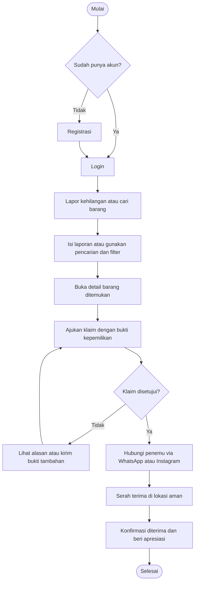
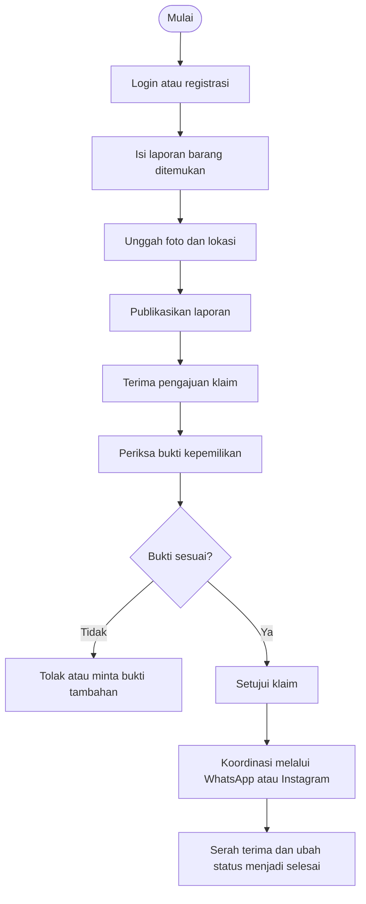
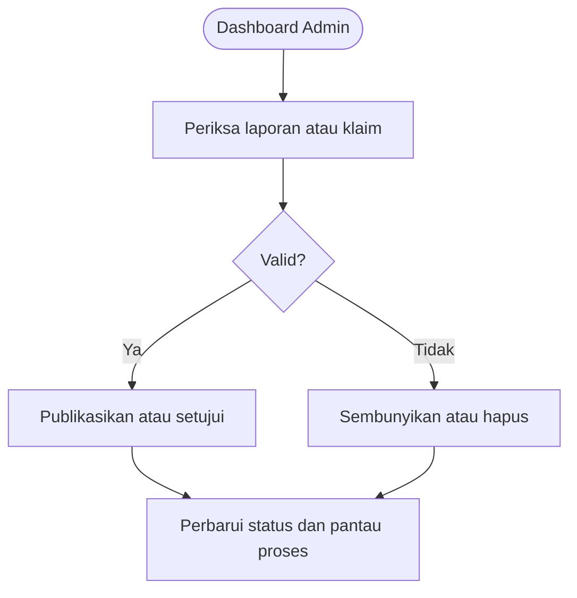

# PRODUCT REQUIREMENT DOCUMENT (PRD)

# Find & Found

## 1. Latar Belakang

Banyak orang kehilangan barang penting seperti kunci, dompet, ponsel, uang, KTP, SIM, dan kartu pelajar. Berdasarkan survei terhadap 50 responden di Kabupaten Pati dan sekitarnya, sekitar 90% pernah mengalami kehilangan barang. Saat ini, informasi barang hilang atau ditemukan tersebar di media sosial, pos keamanan, dan lingkungan sekitar sehingga sulit dicari, cepat tertimbun, serta tidak memiliki proses verifikasi yang jelas.

Find & Found menjadi wadah terpusat untuk melaporkan, mencari, mengklaim, dan mengembalikan barang hilang. Platform ini memprioritaskan dokumen penting, menyediakan pencarian berbasis kategori dan lokasi, serta membuka kontak WhatsApp atau Instagram hanya setelah klaim terverifikasi.

## 2. Tujuan

- Memusatkan informasi barang hilang dan ditemukan di wilayah Pati dan sekitarnya.
- Mempercepat pencarian melalui kata kunci, kategori, status, tanggal, wilayah, dan lokasi peta.
- Mencegah klaim palsu melalui bukti kepemilikan dan proses persetujuan.
- Memudahkan koordinasi pengembalian melalui WhatsApp atau Instagram setelah klaim disetujui.
- Mendorong kejujuran penemu melalui apresiasi, rating, dan badge reputasi.
- Menjaga privasi nomor kontak, identitas, dan dokumen sensitif.

## 3. Define User Persona

### 3.1 Pemilik Barang yang Hilang

- **Profil:** Pelajar, mahasiswa, atau masyarakat umum usia 15–22 tahun di Pati dan sekitarnya.
- **Kebutuhan:** Menemukan barang dengan cepat dan membuktikan kepemilikan.
- **Masalah:** Panik, tidak tahu harus melapor ke mana, dan sulit mengetahui apakah barang telah ditemukan.
- **Perilaku:** Menggunakan smartphone serta membutuhkan proses yang sederhana.

### 3.2 Penemu Barang

- **Profil:** Pelajar, masyarakat umum, satpam, atau pengelola fasilitas.
- **Kebutuhan:** Melaporkan barang dengan cepat dan menyerahkannya kepada pemilik sah.
- **Masalah:** Tidak memiliki kontak pemilik dan khawatir dituduh menyalahgunakan barang.
- **Perilaku:** Bersedia membantu jika proses pelaporan singkat dan aman.

### 3.3 Administrator atau Pengelola Wilayah

- **Profil:** Admin komunitas, sekolah, institusi, atau pengelola platform.
- **Kebutuhan:** Menjaga kualitas data dan keamanan proses klaim.
- **Tugas:** Memoderasi laporan, memeriksa dokumen sensitif, menangani spam atau laporan palsu, serta mengelola kategori dan pengguna.

## 4. MVP

### 4.1 Fitur Inti

1. **Akun pengguna**
   - Registrasi, login, logout, dan pemulihan password.
   - Profil berisi nama, email, nomor WhatsApp, Instagram opsional, domisili, dan reputasi.

2. **Pelaporan barang hilang dan ditemukan**
   - Form berisi jenis laporan, nama barang, kategori, foto, waktu, lokasi, deskripsi, dan titik peta.
   - Ciri rahasia dapat disimpan untuk kebutuhan verifikasi.
   - Status laporan: terbuka, diklaim, selesai, atau dibatalkan.

3. **Pencarian barang**
   - Pencarian kata kunci.
   - Filter jenis laporan, kategori, status, tanggal, kecamatan, dan lokasi.
   - Dokumen penting seperti KTP, SIM, paspor, dan kartu pelajar diberi tanda prioritas.

4. **Detail barang dan peta**
   - Menampilkan foto, deskripsi, waktu, lokasi, kategori, serta titik peta.
   - Data kontak pribadi tidak ditampilkan kepada publik.

5. **Klaim dan verifikasi kepemilikan**
   - Pemilik mengirim jawaban ciri khusus, deskripsi bukti, dan foto pembanding opsional.
   - Penemu atau admin menyetujui, menolak, atau meminta bukti tambahan.
   - Kontak hanya terbuka setelah klaim disetujui.

6. **Koordinasi dan penyelesaian**
   - Tombol WhatsApp atau Instagram untuk koordinasi serah terima.
   - Serah terima dilakukan di lokasi aman, seperti pos satpam.
   - Laporan dapat ditandai selesai setelah barang diterima.

7. **Riwayat dan notifikasi**
   - Pengguna melihat laporan, klaim, dan status prosesnya.
   - Notifikasi diberikan untuk perubahan status atau kecocokan laporan.

8. **Moderasi admin**
   - Admin meninjau, menyetujui, menyembunyikan, atau menghapus laporan spam, palsu, dan duplikat.
   - Admin mengelola kategori, wilayah, dan akun pengguna.

9. **Apresiasi penemu**
   - Pemilik dapat memberi rating, badge, atau reward sukarela.
   - Penemu memperoleh poin reputasi.

### 4.2 Batasan MVP

- Komunikasi dilakukan melalui deep link WhatsApp atau Instagram, bukan chat internal.
- Aplikasi berbentuk web responsif dan mobile-first.
- Frontend menggunakan Vue.js 3, Vue Router, Pinia, dan Tailwind CSS.
- Backend menggunakan Laravel REST API dengan autentikasi token.
- Database menggunakan MySQL atau MariaDB.
- Peta menggunakan Leaflet dan OpenStreetMap.
- Foto disimpan pada local storage saat pengembangan dan object storage saat produksi.

### 4.3 Keamanan dan Kualitas

- Nomor telepon dan identitas sensitif dimasking.
- Foto dokumen penting diburamkan pada informasi yang tidak diperlukan.
- Kontak hanya tersedia setelah klaim terverifikasi.
- Antarmuka responsif pada ponsel hingga desktop.
- Form pelaporan dibuat bertahap agar tidak terlalu panjang.
- Target waktu muat awal kurang dari 1,5 detik pada koneksi 4G.

## 5. User Flow

### 5.1 Alur Pemilik Barang

### 5.2 Alur Penemu Barang

### 5.3 Alur Admin

## 6. Wireframe

Wireframe MVP mencakup tiga kelompok halaman: publik, pengguna terautentikasi, dan admin.

### 6.1 Halaman Publik

- **Home (`/`)**: identitas platform, pencarian cepat, laporan terbaru, dan dokumen prioritas.
- **Explore (`/explore`)**: daftar barang dengan pencarian dan filter.
- **Detail Barang (`/items/:id`)**: foto, deskripsi, lokasi, peta, serta tombol klaim.
- **Dokumen Prioritas (`/priority-documents`)**: daftar KTP, SIM, paspor, dan kartu pelajar.
- **Login (`/login`)** dan **Register (`/register`)**: akses akun.
- **About (`/about`)**: penjelasan platform dan panduan penggunaan.

### 6.2 Halaman Pengguna

- **Dashboard (`/dashboard`)**: ringkasan laporan, klaim, notifikasi, dan status.
- **Lapor Barang (`/report/lost`, `/report/found`)**: form bertahap untuk laporan kehilangan atau penemuan.
- **Laporan Saya (`/my-reports`)**: daftar dan status laporan pengguna.
- **Klaim Saya (`/my-claims`)**: status pengajuan klaim.
- **Klaim Masuk (`/incoming-claims`)**: pemeriksaan klaim atas barang temuan.
- **Notifikasi (`/notifications`)**: kecocokan barang dan perubahan status.
- **Profil (`/profile`)**: data akun, kontak, dan badge reputasi.

### 6.3 Halaman Admin

- **Dashboard (`/admin/dashboard`)**: statistik laporan aktif, selesai, dan menunggu moderasi.
- **Items (`/admin/items`)**: moderasi semua laporan.
- **Claims (`/admin/claims`)**: pengawasan klaim dan sengketa.
- **Categories (`/admin/categories`)**: pengelolaan kategori dan tanda prioritas.
- **Users (`/admin/users`)**: pengelolaan akun dan pemblokiran pengguna.

### 6.4 Wireframe Inti

#### Home

.png)

#### Explore

.png)

#### Detail Barang

.png)

#### Lapor Barang Ditemukan

.png)

#### Klaim Masuk

.png)

#### Dashboard Pengguna

.png)

Setiap wireframe menggunakan prinsip mobile-first, kartu laporan dengan foto, badge `LOST` atau `FOUND`, badge prioritas dokumen, filter yang mudah disentuh, serta tombol aksi yang jelas.
