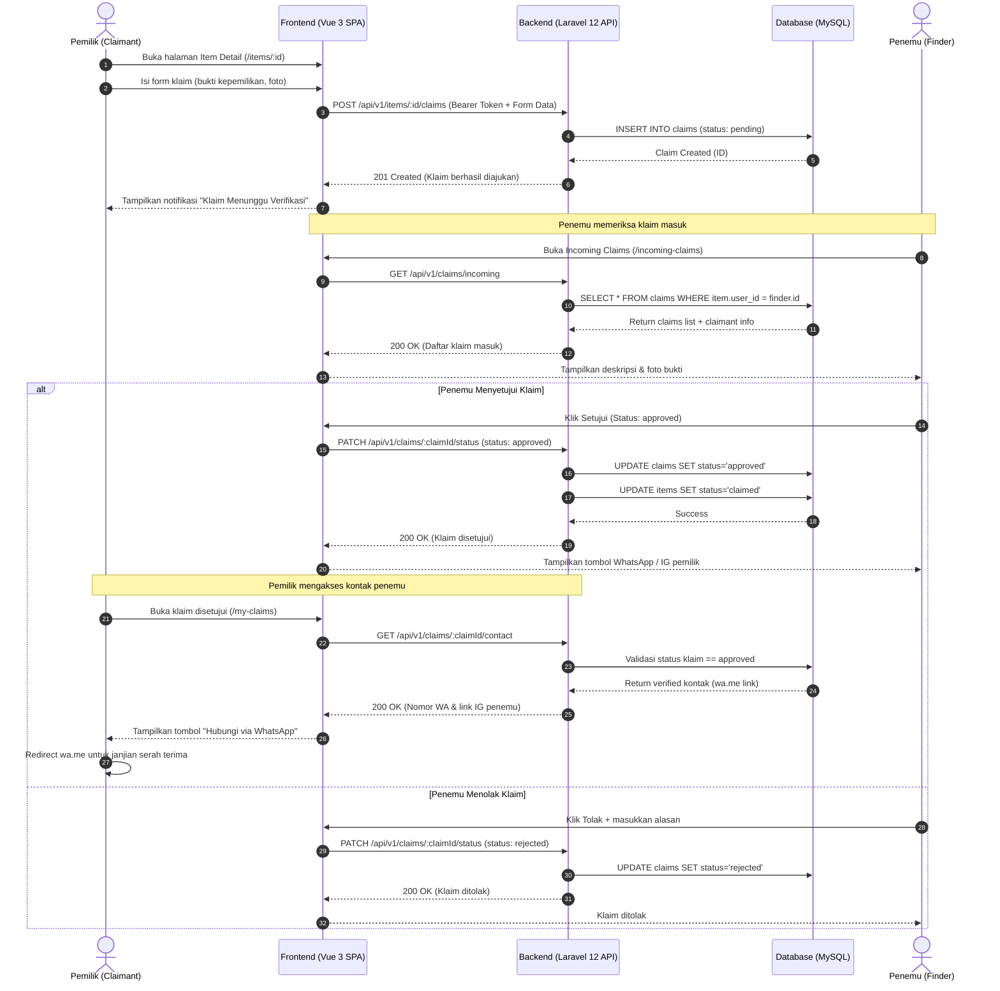
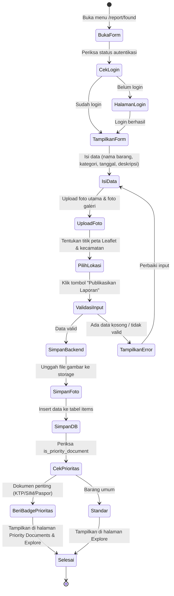

# Diagram UML Sistem Find & Found

Berdasarkan dokumen spesifikasi dan arsitektur sistem pada repository ini, berikut kumpulan diagram UML standar (Mermaid format).

---

## 1. Use Case Diagram

Diagram use case memetakan interaksi antara 3 aktor utama (*Public/Guest*, *Authenticated User*, dan *Admin*) dengan modul sistem Find & Found.

```mermaid
graph LR
    actor Guest as "Guest / Publik"
    actor User as "User Terdaftar (Owner / Finder)"
    actor Admin as "Administrator"

    subgraph System ["Sistem Find & Found"]
        UC1(["Registrasi & Login"])
        UC2(["Eksplorasi & Filter Barang"])
        UC3(["Lihat Detail Barang & Peta"])
        UC4(["Lihat Dokumen Prioritas"])
        
        UC5(["Lapor Barang Hilang (Lost)"])
        UC6(["Lapor Barang Ditemukan (Found)"])
        UC7(["Ajukan Klaim Kepemilikan"])
        UC8(["Verifikasi / Review Klaim"])
        UC9(["Akses Kontak WhatsApp / IG"])
        UC10(["Kelola Profil & Reputasi"])
        
        UC11(["Moderasi Laporan Barang"])
        UC12(["Kelola Sengketa Klaim"])
        UC13(["Kelola Master Kategori"])
        UC14(["Manajemen User & Blacklist"])
        UC15(["Lihat Statistik Dashboard Admin"])
    end

    %% Relasi Guest
    Guest --> UC1
    Guest --> UC2
    Guest --> UC3
    Guest --> UC4

    %% Relasi User Terdaftar (mewarisi Guest)
    User --> UC2
    User --> UC3
    User --> UC4
    User --> UC5
    User --> UC6
    User --> UC7
    User --> UC8
    User --> UC9
    User --> UC10

    %% Relasi Admin
    Admin --> UC11
    Admin --> UC12
    Admin --> UC13
    Admin --> UC14
    Admin --> UC15

    %% Include / Extend
    UC7 -.->|includes| UC3
    UC9 -.->|extends (jika klaim disetujui)| UC8
```

---

## 2. Class Diagram

Diagram kelas memetakan struktur entitas data, model Eloquent ORM, atribut, tipe data, method, dan relasi antar kelas.

```mermaid
classDiagram
    direction TB

    class User {
        +BigInteger id
        +String name
        +String email
        +String password
        +String phone_number
        +String instagram_handle
        +String domicile_city
        +String avatar_url
        +Integer reputation_points
        +Role role
        +Timestamp created_at
        +Timestamp updated_at
        +register()
        +login()
        +updateProfile()
        +addReputation(points)
    }

    class Category {
        +Integer id
        +String name
        +String slug
        +String icon
        +Boolean is_priority_document
        +Timestamp created_at
        +Timestamp updated_at
        +getItems()
    }

    class Item {
        +BigInteger id
        +BigInteger user_id
        +Integer category_id
        +ItemType type
        +String title
        +String description
        +String secret_details
        +DateTime incident_date
        +String location_name
        +String district
        +Decimal latitude
        +Decimal longitude
        +String primary_photo_url
        +String reward_offered
        +ItemStatus status
        +Timestamp created_at
        +Timestamp updated_at
        +createReport()
        +updateStatus(status)
        +getClaims()
    }

    class ItemPhoto {
        +BigInteger id
        +BigInteger item_id
        +String photo_url
        +Timestamp created_at
    }

    class Claim {
        +BigInteger id
        +BigInteger item_id
        +BigInteger claimant_id
        +String proof_description
        +String proof_photo_url
        +ClaimStatus status
        +String response_notes
        +Timestamp created_at
        +Timestamp updated_at
        +submitClaim()
        +approve(notes)
        +reject(notes)
        +getUnlockedContact()
    }

    <<enumeration>> Role
    Role : USER
    Role : ADMIN

    <<enumeration>> ItemType
    ItemType : LOST
    ItemType : FOUND

    <<enumeration>> ItemStatus
    ItemStatus : OPEN
    ItemStatus : CLAIMED
    ItemStatus : RESOLVED
    ItemStatus : CANCELLED

    <<enumeration>> ClaimStatus
    ClaimStatus : PENDING
    ClaimStatus : APPROVED
    ClaimStatus : REJECTED

    User "1" --> "0..*" Item : "membuat laporan"
    User "1" --> "0..*" Claim : "mengajukan klaim"
    Category "1" --> "0..*" Item : "mengelompokkan"
    Item "1" *-- "0..*" ItemPhoto : "memiliki foto galeri"
    Item "1" --> "0..*" Claim : "menerima permohonan"
```

---

## 3. Sequence Diagram: Alur Pengajuan dan Verifikasi Klaim

Menampilkan interaksi berurutan antara Pemilik (*Claimant*), Frontend (Vue 3), Backend API (Laravel 12), Database, dan Penemu (*Finder*).



---

## 4. Activity Diagram: Pelaporan Barang Ditemukan (Found Item)

Menjelaskan alur aktivitas dan percabangan keputusan saat pengguna melaporkan barang temuan.


